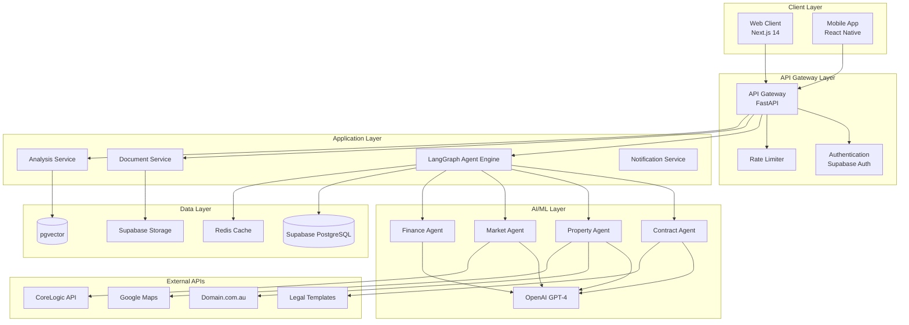
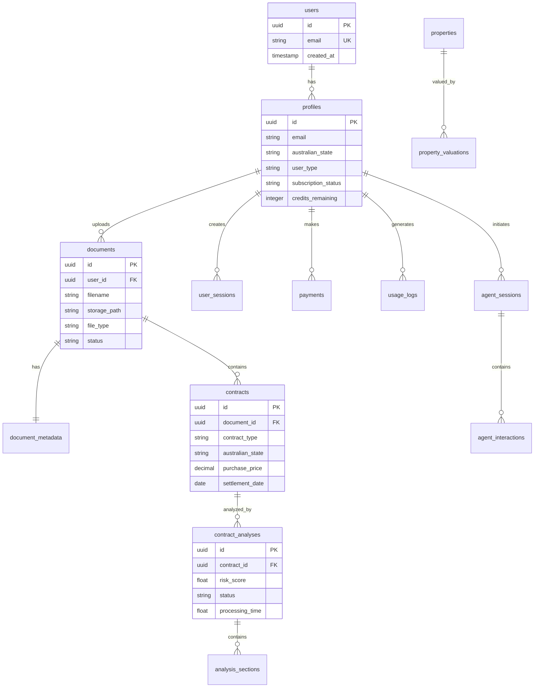
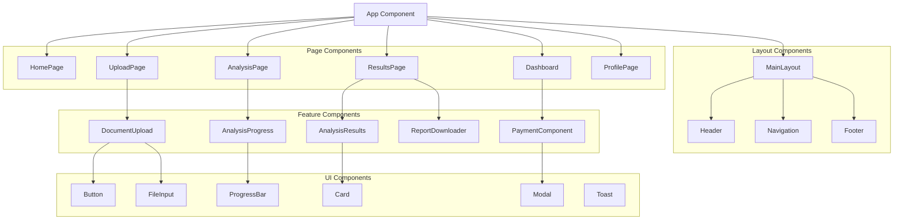
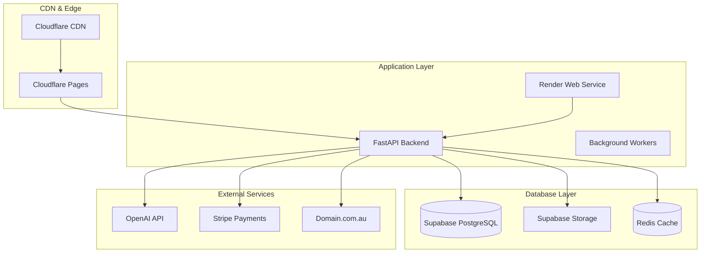

# Real2.AI System Design Specification

## Design Overview

**Project**: Real2.AI - Australian Real Estate AI Assistant  
**Version**: 1.0  
**Date**: August 2025  
**Architecture Pattern**: Event-Driven Microservices with Multi-Agent AI Orchestration

## System Architecture Design

### High-Level Architecture



## LangGraph Agent Architecture Design

### Agent State Management

```python
from typing import TypedDict, Optional, Dict, List, Any
from langgraph import StateGraph
from langchain.tools import tool

class RealEstateAgentState(TypedDict):
    """Central state for all Real2.AI agents"""
    # Session Management
    user_id: str
    session_id: str
    agent_version: str
    
    # Document Processing
    document_data: Optional[Dict[str, Any]]
    document_metadata: Optional[Dict[str, Any]]
    parsing_status: str  # 'pending', 'processing', 'completed', 'failed'
    
    # Contract Analysis
    contract_terms: Optional[Dict[str, Any]]
    risk_assessment: Optional[Dict[str, Any]]
    compliance_check: Optional[Dict[str, Any]]
    recommendations: List[Dict[str, Any]]
    
    # Property Data (Phase 2+)
    property_data: Optional[Dict[str, Any]]
    market_analysis: Optional[Dict[str, Any]]
    financial_analysis: Optional[Dict[str, Any]]
    
    # User Context
    user_preferences: Dict[str, Any]
    australian_state: str  # NSW, VIC, QLD, etc.
    user_type: str  # buyer, investor, agent
    
    # Processing State
    current_step: str
    error_state: Optional[str]
    confidence_scores: Dict[str, float]
    processing_time: Optional[float]
    
    # Output
    analysis_results: Dict[str, Any]
    report_data: Optional[Dict[str, Any]]
    final_recommendations: List[Dict[str, Any]]
```

### Multi-Agent Workflow Design

```python
class ContractAnalysisWorkflow:
    """Phase 1 MVP: Contract Review Agent Workflow"""
    
    def create_workflow(self) -> StateGraph:
        workflow = StateGraph(RealEstateAgentState)
        
        # Core Processing Nodes
        workflow.add_node("validate_input", self.validate_input)
        workflow.add_node("process_document", self.process_document)
        workflow.add_node("extract_terms", self.extract_contract_terms)
        workflow.add_node("analyze_compliance", self.analyze_australian_compliance)
        workflow.add_node("assess_risks", self.assess_contract_risks)
        workflow.add_node("generate_recommendations", self.generate_recommendations)
        workflow.add_node("compile_report", self.compile_analysis_report)
        
        # Error Handling Nodes
        workflow.add_node("handle_error", self.handle_processing_error)
        workflow.add_node("retry_processing", self.retry_failed_step)
        
        # Entry Point
        workflow.set_entry_point("validate_input")
        
        # Linear Processing Flow
        workflow.add_edge("validate_input", "process_document")
        workflow.add_edge("process_document", "extract_terms")
        workflow.add_edge("extract_terms", "analyze_compliance")
        workflow.add_edge("analyze_compliance", "assess_risks")
        workflow.add_edge("assess_risks", "generate_recommendations")
        workflow.add_edge("generate_recommendations", "compile_report")
        
        # Conditional Error Handling
        workflow.add_conditional_edges(
            "process_document",
            self.check_processing_success,
            {
                "success": "extract_terms",
                "retry": "retry_processing",
                "error": "handle_error"
            }
        )
        
        workflow.add_conditional_edges(
            "extract_terms",
            self.check_extraction_quality,
            {
                "high_confidence": "analyze_compliance",
                "low_confidence": "retry_processing", 
                "error": "handle_error"
            }
        )
        
        # Terminal Conditions
        workflow.add_edge("compile_report", "__end__")
        workflow.add_edge("handle_error", "__end__")
        
        return workflow.compile()
    
    def validate_input(self, state: RealEstateAgentState) -> RealEstateAgentState:
        """Validate document and user input"""
        if not state.get("document_data"):
            state["error_state"] = "No document provided"
            return state
            
        if not state.get("australian_state"):
            state["error_state"] = "Australian state not specified"
            return state
            
        state["current_step"] = "input_validated"
        return state
    
    def process_document(self, state: RealEstateAgentState) -> RealEstateAgentState:
        """Extract text from document using OCR if needed"""
        try:
            # Document processing logic
            state["parsing_status"] = "completed"
            state["current_step"] = "document_processed"
            return state
        except Exception as e:
            state["error_state"] = f"Document processing failed: {str(e)}"
            state["parsing_status"] = "failed"
            return state
```

### Australian-Specific Agent Tools

```python
@tool
def extract_australian_contract_terms(document_text: str, state: str) -> Dict[str, Any]:
    """Extract key terms from Australian property contract with state-specific rules"""
    prompt = f"""
    Extract key contract terms from this Australian {state} property contract:
    
    Required Terms:
    - Purchase price and deposit amount
    - Settlement date and cooling-off period
    - Property address and legal description
    - Special conditions (finance, building & pest, strata)
    - Vendor and purchaser details
    - Conveyancer/solicitor details
    
    State-specific requirements for {state}:
    - {get_state_specific_requirements(state)}
    
    Contract text: {document_text}
    
    Return structured JSON with confidence scores.
    """
    
    # LLM processing
    result = llm.invoke(prompt)
    return {
        "terms": result.terms,
        "confidence": result.confidence,
        "state_compliance": result.state_compliance
    }

@tool
def validate_cooling_off_period(contract_terms: Dict, state: str) -> Dict[str, Any]:
    """Validate cooling-off period compliance by Australian state"""
    
    cooling_off_rules = {
        "NSW": {"days": 5, "business_days": True, "exclusions": ["auction", "investment"]},
        "VIC": {"days": 3, "business_days": True, "exclusions": ["auction"]},
        "QLD": {"days": 5, "calendar_days": True, "exclusions": ["auction", "contract_race"]},
        "SA": {"days": 2, "clear_days": True, "exclusions": ["auction"]},
        "WA": {"days": 5, "business_days": True, "exclusions": ["auction"]},
        "TAS": {"days": None, "note": "No statutory cooling-off period"},
        "NT": {"days": None, "note": "No statutory cooling-off period"},
        "ACT": {"days": 5, "business_days": True, "exclusions": ["auction"]}
    }
    
    rule = cooling_off_rules.get(state)
    contract_period = contract_terms.get("cooling_off_period")
    
    return {
        "compliant": validate_period_compliance(contract_period, rule),
        "required_period": rule,
        "contract_period": contract_period,
        "warnings": generate_cooling_off_warnings(contract_period, rule, state)
    }

@tool
def calculate_stamp_duty(purchase_price: float, state: str, is_first_home: bool, 
                        is_foreign_buyer: bool = False) -> Dict[str, Any]:
    """Calculate Australian stamp duty with state-specific rates and exemptions"""
    
    stamp_duty_rates = {
        "NSW": {
            "thresholds": [(14000, 0.0125), (32000, 0.015), (85000, 0.0175), 
                          (319000, 0.035), (1064000, 0.045), (float('inf'), 0.055)],
            "first_home_exemption": 650000,
            "foreign_buyer_surcharge": 0.08
        },
        "VIC": {
            "thresholds": [(25000, 0.014), (130000, 0.024), (960000, 0.06), (float('inf'), 0.055)],
            "first_home_exemption": 600000,
            "foreign_buyer_surcharge": 0.07
        }
        # ... other states
    }
    
    base_duty = calculate_base_stamp_duty(purchase_price, stamp_duty_rates[state])
    exemptions = calculate_exemptions(purchase_price, state, is_first_home)
    surcharges = calculate_surcharges(purchase_price, state, is_foreign_buyer)
    
    return {
        "base_duty": base_duty,
        "exemptions": exemptions,
        "surcharges": surcharges,
        "total_duty": base_duty - exemptions + surcharges,
        "breakdown": generate_duty_breakdown(base_duty, exemptions, surcharges)
    }

@tool
def analyze_special_conditions(contract_terms: Dict, state: str) -> List[Dict[str, Any]]:
    """Analyze Australian-specific special conditions and risks"""
    
    conditions = contract_terms.get("special_conditions", [])
    analysis_results = []
    
    for condition in conditions:
        condition_type = classify_condition_type(condition)
        risk_level = assess_condition_risk(condition, condition_type, state)
        recommendations = generate_condition_recommendations(condition, condition_type, state)
        
        analysis_results.append({
            "condition": condition,
            "type": condition_type,
            "risk_level": risk_level,
            "recommendations": recommendations,
            "state_specific_notes": get_state_specific_notes(condition_type, state)
        })
    
    return analysis_results
```

## API Design Specification

### RESTful API Architecture

```yaml
openapi: 3.0.3
info:
  title: Real2.AI API
  version: 1.0.0
  description: Australian Real Estate AI Assistant API

servers:
  - url: https://api.real2.ai/v1
    description: Production server
  - url: https://staging-api.real2.ai/v1
    description: Staging server

paths:
  # Authentication
  /auth/register:
    post:
      summary: Register new user
      requestBody:
        required: true
        content:
          application/json:
            schema:
              type: object
              properties:
                email:
                  type: string
                  format: email
                password:
                  type: string
                  minLength: 8
                australian_state:
                  type: string
                  enum: [NSW, VIC, QLD, SA, WA, TAS, NT, ACT]
                user_type:
                  type: string
                  enum: [buyer, investor, agent, conveyancer]
              required: [email, password, australian_state]
      responses:
        201:
          description: User registered successfully
        400:
          description: Invalid input data
        409:
          description: Email already exists

  /auth/login:
    post:
      summary: User login
      requestBody:
        required: true
        content:
          application/json:
            schema:
              type: object
              properties:
                email:
                  type: string
                  format: email
                password:
                  type: string
              required: [email, password]
      responses:
        200:
          description: Login successful
          content:
            application/json:
              schema:
                type: object
                properties:
                  access_token:
                    type: string
                  refresh_token:
                    type: string
                  user_profile:
                    $ref: '#/components/schemas/UserProfile'

  # Document Management
  /documents/upload:
    post:
      summary: Upload contract document
      security:
        - bearerAuth: []
      requestBody:
        required: true
        content:
          multipart/form-data:
            schema:
              type: object
              properties:
                file:
                  type: string
                  format: binary
                  description: PDF, DOC, or DOCX file (max 50MB)
                contract_type:
                  type: string
                  enum: [purchase_agreement, lease_agreement, off_plan, auction]
                australian_state:
                  type: string
                  enum: [NSW, VIC, QLD, SA, WA, TAS, NT, ACT]
              required: [file, contract_type, australian_state]
      responses:
        201:
          description: Document uploaded successfully
          content:
            application/json:
              schema:
                $ref: '#/components/schemas/DocumentResponse'

  /documents/{document_id}:
    get:
      summary: Get document details
      security:
        - bearerAuth: []
      parameters:
        - name: document_id
          in: path
          required: true
          schema:
            type: string
            format: uuid
      responses:
        200:
          description: Document details
          content:
            application/json:
              schema:
                $ref: '#/components/schemas/DocumentDetails'

  # Contract Analysis
  /contracts/analyze:
    post:
      summary: Start contract analysis
      security:
        - bearerAuth: []
      requestBody:
        required: true
        content:
          application/json:
            schema:
              type: object
              properties:
                document_id:
                  type: string
                  format: uuid
                analysis_options:
                  type: object
                  properties:
                    include_risk_assessment:
                      type: boolean
                      default: true
                    include_stamp_duty:
                      type: boolean
                      default: true
                    include_recommendations:
                      type: boolean
                      default: true
                    detailed_compliance_check:
                      type: boolean
                      default: true
              required: [document_id]
      responses:
        202:
          description: Analysis started
          content:
            application/json:
              schema:
                $ref: '#/components/schemas/AnalysisJobResponse'

  /contracts/{contract_id}/analysis:
    get:
      summary: Get contract analysis results
      security:
        - bearerAuth: []
      parameters:
        - name: contract_id
          in: path
          required: true
          schema:
            type: string
            format: uuid
      responses:
        200:
          description: Analysis results
          content:
            application/json:
              schema:
                $ref: '#/components/schemas/ContractAnalysis'

  /contracts/{contract_id}/report:
    get:
      summary: Download analysis report PDF
      security:
        - bearerAuth: []
      parameters:
        - name: contract_id
          in: path
          required: true
          schema:
            type: string
            format: uuid
        - name: format
          in: query
          schema:
            type: string
            enum: [pdf, json]
            default: pdf
      responses:
        200:
          description: Analysis report
          content:
            application/pdf:
              schema:
                type: string
                format: binary

components:
  securitySchemes:
    bearerAuth:
      type: http
      scheme: bearer
      bearerFormat: JWT

  schemas:
    UserProfile:
      type: object
      properties:
        id:
          type: string
          format: uuid
        email:
          type: string
          format: email
        australian_state:
          type: string
        user_type:
          type: string
        subscription_status:
          type: string
          enum: [free, premium, enterprise]
        credits_remaining:
          type: integer

    DocumentResponse:
      type: object
      properties:
        document_id:
          type: string
          format: uuid
        filename:
          type: string
        file_size:
          type: integer
        upload_status:
          type: string
          enum: [uploaded, processing, processed, failed]
        processing_time:
          type: number

    ContractAnalysis:
      type: object
      properties:
        contract_id:
          type: string
          format: uuid
        analysis_status:
          type: string
          enum: [pending, processing, completed, failed]
        contract_terms:
          type: object
          properties:
            purchase_price:
              type: number
            deposit_amount:
              type: number
            settlement_date:
              type: string
              format: date
            cooling_off_period:
              type: string
            property_address:
              type: string
        risk_assessment:
          type: object
          properties:
            overall_risk_score:
              type: number
              minimum: 0
              maximum: 10
            risk_factors:
              type: array
              items:
                type: object
                properties:
                  factor:
                    type: string
                  severity:
                    type: string
                    enum: [low, medium, high, critical]
                  description:
                    type: string
        compliance_check:
          type: object
          properties:
            state_compliance:
              type: boolean
            compliance_issues:
              type: array
              items:
                type: string
        stamp_duty_calculation:
          type: object
          properties:
            base_duty:
              type: number
            exemptions:
              type: number
            surcharges:
              type: number
            total_duty:
              type: number
        recommendations:
          type: array
          items:
            type: object
            properties:
              priority:
                type: string
                enum: [low, medium, high, critical]
              category:
                type: string
              recommendation:
                type: string
              action_required:
                type: boolean
```

### WebSocket API for Real-time Updates

```python
# WebSocket Event Types
class WebSocketEventTypes:
    # Analysis Progress
    ANALYSIS_STARTED = "analysis_started"
    ANALYSIS_PROGRESS = "analysis_progress"
    ANALYSIS_COMPLETED = "analysis_completed"
    ANALYSIS_FAILED = "analysis_failed"
    
    # Document Processing
    DOCUMENT_PROCESSING = "document_processing"
    DOCUMENT_PROCESSED = "document_processed"
    DOCUMENT_FAILED = "document_failed"
    
    # Agent Updates
    AGENT_STEP_STARTED = "agent_step_started"
    AGENT_STEP_COMPLETED = "agent_step_completed"
    AGENT_ERROR = "agent_error"

# WebSocket Message Schema
class WebSocketMessage:
    def __init__(self, event_type: str, data: Dict[str, Any], session_id: str):
        self.event_type = event_type
        self.data = data
        self.session_id = session_id
        self.timestamp = datetime.utcnow().isoformat()

# Example WebSocket Events
analysis_progress_event = {
    "event_type": "analysis_progress",
    "data": {
        "contract_id": "123e4567-e89b-12d3-a456-426614174000",
        "current_step": "extract_terms",
        "progress_percentage": 35,
        "estimated_completion": "2024-08-03T10:15:30Z",
        "message": "Extracting contract terms..."
    },
    "session_id": "user_session_456",
    "timestamp": "2024-08-03T10:12:30Z"
}

analysis_completed_event = {
    "event_type": "analysis_completed",
    "data": {
        "contract_id": "123e4567-e89b-12d3-a456-426614174000",
        "analysis_summary": {
            "overall_risk_score": 6.5,
            "total_recommendations": 8,
            "compliance_status": "compliant",
            "processing_time_seconds": 45.2
        },
        "report_url": "/api/contracts/123e4567-e89b-12d3-a456-426614174000/report"
    },
    "session_id": "user_session_456",
    "timestamp": "2024-08-03T10:13:15Z"
}
```

## Database Schema Design

### Entity Relationship Model



### Comprehensive Database Schema

```sql
-- Enable required extensions
CREATE EXTENSION IF NOT EXISTS "uuid-ossp";
CREATE EXTENSION IF NOT EXISTS "pgcrypto";
CREATE EXTENSION IF NOT EXISTS "vector";
CREATE EXTENSION IF NOT EXISTS "postgis";

-- User profiles (Supabase Auth integration)
CREATE TABLE profiles (
    id UUID PRIMARY KEY REFERENCES auth.users(id) ON DELETE CASCADE,
    email TEXT UNIQUE NOT NULL,
    australian_state TEXT NOT NULL CHECK (australian_state IN ('NSW', 'VIC', 'QLD', 'SA', 'WA', 'TAS', 'NT', 'ACT')),
    user_type TEXT NOT NULL CHECK (user_type IN ('buyer', 'investor', 'agent', 'conveyancer')) DEFAULT 'buyer',
    subscription_status TEXT NOT NULL CHECK (subscription_status IN ('free', 'premium', 'enterprise')) DEFAULT 'free',
    credits_remaining INTEGER NOT NULL DEFAULT 1,
    preferences JSONB DEFAULT '{}',
    created_at TIMESTAMPTZ DEFAULT NOW(),
    updated_at TIMESTAMPTZ DEFAULT NOW()
);

-- Document management
CREATE TABLE documents (
    id UUID PRIMARY KEY DEFAULT gen_random_uuid(),
    user_id UUID REFERENCES profiles(id) ON DELETE CASCADE,
    filename TEXT NOT NULL,
    storage_path TEXT NOT NULL,
    file_type TEXT NOT NULL CHECK (file_type IN ('pdf', 'doc', 'docx')),
    file_size INTEGER NOT NULL CHECK (file_size <= 52428800), -- 50MB limit
    status TEXT NOT NULL CHECK (status IN ('uploaded', 'processing', 'processed', 'failed')) DEFAULT 'uploaded',
    uploaded_at TIMESTAMPTZ DEFAULT NOW()
);

CREATE TABLE document_metadata (
    id UUID PRIMARY KEY DEFAULT gen_random_uuid(),
    document_id UUID REFERENCES documents(id) ON DELETE CASCADE,
    page_count INTEGER,
    ocr_confidence FLOAT CHECK (ocr_confidence >= 0 AND ocr_confidence <= 1),
    australian_contract_type TEXT CHECK (australian_contract_type IN ('nsw_standard', 'vic_standard', 'qld_standard', 'custom')),
    extracted_text JSONB,
    processing_metadata JSONB DEFAULT '{}'
);

-- Contract analysis tables
CREATE TABLE contracts (
    id UUID PRIMARY KEY DEFAULT gen_random_uuid(),
    document_id UUID REFERENCES documents(id) ON DELETE CASCADE,
    contract_type TEXT NOT NULL CHECK (contract_type IN ('purchase_agreement', 'lease_agreement', 'off_plan', 'auction')),
    parsed_data JSONB DEFAULT '{}',
    australian_state TEXT NOT NULL CHECK (australian_state IN ('NSW', 'VIC', 'QLD', 'SA', 'WA', 'TAS', 'NT', 'ACT')),
    property_address TEXT,
    purchase_price DECIMAL(12,2),
    settlement_date DATE,
    created_at TIMESTAMPTZ DEFAULT NOW()
);

CREATE TABLE contract_analyses (
    id UUID PRIMARY KEY DEFAULT gen_random_uuid(),
    contract_id UUID REFERENCES contracts(id) ON DELETE CASCADE,
    agent_version TEXT NOT NULL DEFAULT '1.0',
    analysis_result JSONB DEFAULT '{}',
    risk_score FLOAT CHECK (risk_score >= 0 AND risk_score <= 10),
    australian_law_compliance JSONB DEFAULT '{}',
    processing_time FLOAT,
    confidence_scores JSONB DEFAULT '{}',
    status TEXT NOT NULL CHECK (status IN ('pending', 'processing', 'completed', 'failed')) DEFAULT 'pending',
    created_at TIMESTAMPTZ DEFAULT NOW()
);

-- Agent workflow management
CREATE TABLE agent_sessions (
    id UUID PRIMARY KEY DEFAULT gen_random_uuid(),
    user_id UUID REFERENCES profiles(id) ON DELETE CASCADE,
    session_type TEXT NOT NULL CHECK (session_type IN ('contract_analysis', 'property_analysis', 'market_research')),
    state JSONB DEFAULT '{}',
    status TEXT NOT NULL CHECK (status IN ('active', 'completed', 'failed', 'cancelled')) DEFAULT 'active',
    created_at TIMESTAMPTZ DEFAULT NOW(),
    updated_at TIMESTAMPTZ DEFAULT NOW()
);

CREATE TABLE agent_interactions (
    id UUID PRIMARY KEY DEFAULT gen_random_uuid(),
    session_id UUID REFERENCES agent_sessions(id) ON DELETE CASCADE,
    agent_name TEXT NOT NULL,
    step_name TEXT NOT NULL,
    input_data JSONB DEFAULT '{}',
    output_data JSONB DEFAULT '{}',
    execution_time FLOAT,
    status TEXT NOT NULL CHECK (status IN ('success', 'error', 'timeout')) DEFAULT 'success',
    created_at TIMESTAMPTZ DEFAULT NOW()
);

-- Payment and usage tracking
CREATE TABLE payments (
    id UUID PRIMARY KEY DEFAULT gen_random_uuid(),
    user_id UUID REFERENCES profiles(id) ON DELETE CASCADE,
    amount_aud DECIMAL(10,2) NOT NULL CHECK (amount_aud > 0),
    stripe_payment_id TEXT UNIQUE,
    contract_id UUID REFERENCES contracts(id),
    status TEXT NOT NULL CHECK (status IN ('pending', 'succeeded', 'failed', 'refunded')) DEFAULT 'pending',
    created_at TIMESTAMPTZ DEFAULT NOW()
);

CREATE TABLE usage_logs (
    id UUID PRIMARY KEY DEFAULT gen_random_uuid(),
    user_id UUID REFERENCES profiles(id) ON DELETE CASCADE,
    action_type TEXT NOT NULL,
    credits_used INTEGER DEFAULT 0,
    remaining_credits INTEGER,
    timestamp TIMESTAMPTZ DEFAULT NOW()
);

-- Audit and security
CREATE TABLE audit_logs (
    id UUID PRIMARY KEY DEFAULT gen_random_uuid(),
    user_id UUID REFERENCES profiles(id),
    action TEXT NOT NULL,
    table_name TEXT,
    record_id UUID,
    changes JSONB,
    ip_address INET,
    user_agent TEXT,
    timestamp TIMESTAMPTZ DEFAULT NOW()
);

-- Performance indexes
CREATE INDEX idx_profiles_state ON profiles(australian_state);
CREATE INDEX idx_documents_user_status ON documents(user_id, status);
CREATE INDEX idx_contracts_state ON contracts(australian_state);
CREATE INDEX idx_contract_analyses_status ON contract_analyses(status);
CREATE INDEX idx_agent_sessions_user_status ON agent_sessions(user_id, status);
CREATE INDEX idx_payments_user_status ON payments(user_id, status);
CREATE INDEX idx_audit_logs_timestamp ON audit_logs(timestamp DESC);

-- Row Level Security
ALTER TABLE profiles ENABLE ROW LEVEL SECURITY;
CREATE POLICY "Users can view own profile" ON profiles FOR SELECT USING (auth.uid() = id);

ALTER TABLE documents ENABLE ROW LEVEL SECURITY;
CREATE POLICY "Users can access own documents" ON documents FOR ALL USING (auth.uid() = user_id);

-- Real-time subscriptions
ALTER PUBLICATION supabase_realtime ADD TABLE contract_analyses;
ALTER PUBLICATION supabase_realtime ADD TABLE agent_sessions;
```

## Frontend Component Architecture

### Component Hierarchy



### Core Component Specifications

#### DocumentUpload Component

```typescript
interface DocumentUploadProps {
  onUploadComplete: (documentId: string) => void;
  onUploadError: (error: string) => void;
  maxFileSize?: number; // Default: 50MB
  acceptedTypes?: string[]; // Default: ['pdf', 'doc', 'docx']
  australianState: AustralianState;
}

interface UploadState {
  isDragging: boolean;
  isUploading: boolean;
  uploadProgress: number;
  selectedFile: File | null;
  validationErrors: string[];
}

const DocumentUpload: React.FC<DocumentUploadProps> = ({
  onUploadComplete,
  onUploadError,
  maxFileSize = 52428800, // 50MB
  acceptedTypes = ['pdf', 'doc', 'docx'],
  australianState
}) => {
  const [state, setState] = useState<UploadState>({
    isDragging: false,
    isUploading: false,
    uploadProgress: 0,
    selectedFile: null,
    validationErrors: []
  });
  
  const validateFile = (file: File): string[] => {
    const errors: string[] = [];
    
    // File size validation
    if (file.size > maxFileSize) {
      errors.push(`File size must be less than ${maxFileSize / 1024 / 1024}MB`);
    }
    
    // File type validation
    const fileExtension = file.name.split('.').pop()?.toLowerCase();
    if (!fileExtension || !acceptedTypes.includes(fileExtension)) {
      errors.push(`File type must be one of: ${acceptedTypes.join(', ')}`);
    }
    
    // Contract document validation
    if (!file.name.toLowerCase().includes('contract') && !file.name.toLowerCase().includes('agreement')) {
      errors.push('Document should be a property contract or agreement');
    }
    
    return errors;
  };
  
  const handleFileUpload = async (file: File) => {
    const errors = validateFile(file);
    if (errors.length > 0) {
      setState(prev => ({ ...prev, validationErrors: errors }));
      return;
    }
    
    setState(prev => ({ 
      ...prev, 
      isUploading: true, 
      selectedFile: file,
      validationErrors: []
    }));
    
    try {
      const formData = new FormData();
      formData.append('file', file);
      formData.append('contract_type', 'purchase_agreement');
      formData.append('australian_state', australianState);
      
      const response = await fetch('/api/documents/upload', {
        method: 'POST',
        body: formData,
        headers: {
          'Authorization': `Bearer ${getAuthToken()}`
        }
      });
      
      if (!response.ok) {
        throw new Error('Upload failed');
      }
      
      const result = await response.json();
      onUploadComplete(result.document_id);
      
    } catch (error) {
      onUploadError(error.message);
    } finally {
      setState(prev => ({ ...prev, isUploading: false }));
    }
  };
  
  return (
    <div className="document-upload">
      <DropZone 
        onFileSelect={handleFileUpload}
        isDragging={state.isDragging}
        isUploading={state.isUploading}
      />
      {state.validationErrors.length > 0 && (
        <ErrorList errors={state.validationErrors} />
      )}
      {state.isUploading && (
        <ProgressBar progress={state.uploadProgress} />
      )}
    </div>
  );
};
```

#### AnalysisProgress Component

```typescript
interface AnalysisProgressProps {
  contractId: string;
  onComplete: (analysisId: string) => void;
  onError: (error: string) => void;
}

interface AnalysisStep {
  id: string;
  name: string;
  description: string;
  status: 'pending' | 'processing' | 'completed' | 'failed';
  duration?: number;
}

const AnalysisProgress: React.FC<AnalysisProgressProps> = ({
  contractId,
  onComplete,
  onError
}) => {
  const [steps, setSteps] = useState<AnalysisStep[]>([
    { id: 'validate', name: 'Document Validation', description: 'Checking document format and content', status: 'pending' },
    { id: 'extract', name: 'Term Extraction', description: 'Identifying key contract terms', status: 'pending' },
    { id: 'analyze', name: 'Legal Analysis', description: 'Analyzing Australian law compliance', status: 'pending' },
    { id: 'assess', name: 'Risk Assessment', description: 'Evaluating contract risks', status: 'pending' },
    { id: 'recommend', name: 'Recommendations', description: 'Generating actionable advice', status: 'pending' },
    { id: 'compile', name: 'Report Generation', description: 'Creating final report', status: 'pending' }
  ]);
  
  const [currentStep, setCurrentStep] = useState(0);
  const [overallProgress, setOverallProgress] = useState(0);
  
  useEffect(() => {
    // WebSocket connection for real-time updates
    const ws = new WebSocket(`${WS_BASE_URL}/contracts/${contractId}/progress`);
    
    ws.onmessage = (event) => {
      const data = JSON.parse(event.data);
      
      switch (data.event_type) {
        case 'analysis_progress':
          updateStepStatus(data.data.current_step, 'processing');
          setOverallProgress(data.data.progress_percentage);
          break;
          
        case 'analysis_completed':
          setSteps(prev => prev.map(step => ({ ...step, status: 'completed' })));
          setOverallProgress(100);
          onComplete(data.data.analysis_id);
          break;
          
        case 'analysis_failed':
          updateStepStatus(data.data.failed_step, 'failed');
          onError(data.data.error_message);
          break;
      }
    };
    
    ws.onerror = () => {
      onError('Connection lost during analysis');
    };
    
    return () => ws.close();
  }, [contractId]);
  
  const updateStepStatus = (stepId: string, status: AnalysisStep['status']) => {
    setSteps(prev => prev.map(step => 
      step.id === stepId ? { ...step, status } : step
    ));
  };
  
  return (
    <div className="analysis-progress">
      <div className="progress-header">
        <h2>Analyzing Your Contract</h2>
        <div className="overall-progress">
          <ProgressBar progress={overallProgress} />
          <span>{overallProgress}% Complete</span>
        </div>
      </div>
      
      <div className="step-list">
        {steps.map((step, index) => (
          <ProgressStep 
            key={step.id}
            step={step}
            isActive={index === currentStep}
            isCompleted={step.status === 'completed'}
            isFailed={step.status === 'failed'}
          />
        ))}
      </div>
      
      <div className="estimated-time">
        <ClockIcon />
        <span>Estimated completion: {calculateEstimatedTime(steps)} minutes</span>
      </div>
    </div>
  );
};
```

#### AnalysisResults Component

```typescript
interface AnalysisResultsProps {
  analysisId: string;
}

interface ContractAnalysisResult {
  contract_id: string;
  risk_score: number;
  contract_terms: {
    purchase_price: number;
    deposit_amount: number;
    settlement_date: string;
    cooling_off_period: string;
    property_address: string;
  };
  risk_assessment: {
    overall_risk_score: number;
    risk_factors: RiskFactor[];
  };
  compliance_check: {
    state_compliance: boolean;
    compliance_issues: string[];
  };
  stamp_duty_calculation: {
    base_duty: number;
    exemptions: number;
    total_duty: number;
  };
  recommendations: Recommendation[];
}

interface RiskFactor {
  factor: string;
  severity: 'low' | 'medium' | 'high' | 'critical';
  description: string;
  impact: string;
}

interface Recommendation {
  priority: 'low' | 'medium' | 'high' | 'critical';
  category: string;
  recommendation: string;
  action_required: boolean;
}

const AnalysisResults: React.FC<AnalysisResultsProps> = ({ analysisId }) => {
  const [results, setResults] = useState<ContractAnalysisResult | null>(null);
  const [activeTab, setActiveTab] = useState<'overview' | 'risks' | 'compliance' | 'financial'>('overview');
  const [loading, setLoading] = useState(true);
  
  useEffect(() => {
    fetchAnalysisResults();
  }, [analysisId]);
  
  const fetchAnalysisResults = async () => {
    try {
      const response = await fetch(`/api/contracts/${analysisId}/analysis`, {
        headers: {
          'Authorization': `Bearer ${getAuthToken()}`
        }
      });
      
      if (!response.ok) {
        throw new Error('Failed to fetch analysis results');
      }
      
      const data = await response.json();
      setResults(data);
    } catch (error) {
      console.error('Error fetching results:', error);
    } finally {
      setLoading(false);
    }
  };
  
  if (loading) {
    return <LoadingSpinner />;
  }
  
  if (!results) {
    return <ErrorMessage message="Failed to load analysis results" />;
  }
  
  return (
    <div className="analysis-results">
      <ResultsHeader 
        riskScore={results.risk_score}
        complianceStatus={results.compliance_check.state_compliance}
        contractId={results.contract_id}
      />
      
      <TabNavigation 
        activeTab={activeTab}
        onTabChange={setActiveTab}
        tabs={[
          { id: 'overview', label: 'Overview', count: null },
          { id: 'risks', label: 'Risk Factors', count: results.risk_assessment.risk_factors.length },
          { id: 'compliance', label: 'Compliance', count: results.compliance_check.compliance_issues.length },
          { id: 'financial', label: 'Financial', count: null }
        ]}
      />
      
      <div className="tab-content">
        {activeTab === 'overview' && (
          <OverviewTab 
            contractTerms={results.contract_terms}
            recommendations={results.recommendations.filter(r => r.priority === 'high' || r.priority === 'critical')}
          />
        )}
        
        {activeTab === 'risks' && (
          <RisksTab 
            riskFactors={results.risk_assessment.risk_factors}
            overallScore={results.risk_assessment.overall_risk_score}
          />
        )}
        
        {activeTab === 'compliance' && (
          <ComplianceTab 
            complianceStatus={results.compliance_check.state_compliance}
            issues={results.compliance_check.compliance_issues}
          />
        )}
        
        {activeTab === 'financial' && (
          <FinancialTab 
            stampDuty={results.stamp_duty_calculation}
            purchasePrice={results.contract_terms.purchase_price}
            depositAmount={results.contract_terms.deposit_amount}
          />
        )}
      </div>
      
      <div className="results-actions">
        <DownloadReportButton contractId={results.contract_id} />
        <ShareResultsButton analysisId={analysisId} />
        <ScheduleConsultationButton />
      </div>
    </div>
  );
};
```

### State Management Architecture

```typescript
// Global State Store using Zustand
interface AppState {
  // User state
  user: User | null;
  subscription: SubscriptionDetails | null;
  
  // Document state
  uploadedDocuments: Document[];
  currentAnalysis: AnalysisSession | null;
  
  // UI state
  loading: boolean;
  notifications: Notification[];
  
  // Actions
  setUser: (user: User | null) => void;
  addDocument: (document: Document) => void;
  updateAnalysis: (analysis: AnalysisSession) => void;
  showNotification: (notification: Notification) => void;
  clearNotifications: () => void;
}

const useAppStore = create<AppState>((set, get) => ({
  user: null,
  subscription: null,
  uploadedDocuments: [],
  currentAnalysis: null,
  loading: false,
  notifications: [],
  
  setUser: (user) => set({ user }),
  
  addDocument: (document) => set((state) => ({
    uploadedDocuments: [...state.uploadedDocuments, document]
  })),
  
  updateAnalysis: (analysis) => set({ currentAnalysis: analysis }),
  
  showNotification: (notification) => set((state) => ({
    notifications: [...state.notifications, { ...notification, id: generateId() }]
  })),
  
  clearNotifications: () => set({ notifications: [] })
}));

// React Query for API state management
const useContractAnalysis = (contractId: string) => {
  return useQuery({
    queryKey: ['contract-analysis', contractId],
    queryFn: () => fetchContractAnalysis(contractId),
    refetchInterval: (data) => data?.status === 'processing' ? 2000 : false,
    staleTime: 5 * 60 * 1000 // 5 minutes
  });
};

const useDocumentUpload = () => {
  const queryClient = useQueryClient();
  
  return useMutation({
    mutationFn: uploadDocument,
    onSuccess: (data) => {
      queryClient.invalidateQueries({ queryKey: ['documents'] });
      useAppStore.getState().addDocument(data);
    },
    onError: (error) => {
      useAppStore.getState().showNotification({
        type: 'error',
        title: 'Upload Failed',
        message: error.message
      });
    }
  });
};
```

## Deployment & Infrastructure Design

### Production Architecture



### Infrastructure Configuration

#### Render Deployment

```yaml
# render.yaml
services:
  - type: web
    name: real2-ai-api
    env: python
    region: singapore
    plan: starter
    buildCommand: pip install -r requirements.txt
    startCommand: uvicorn main:app --host 0.0.0.0 --port $PORT --workers 2
    healthCheckPath: /health
    envVars:
      - key: SUPABASE_URL
        sync: false
      - key: SUPABASE_ANON_KEY  
        sync: false
      - key: OPENAI_API_KEY
        sync: false
      - key: STRIPE_SECRET_KEY
        sync: false
```

#### Scaling Strategy

```yaml
Phase 1 (0-1K users):
  backend: Render Starter (1 instance, 0.5 vCPU, 512MB)
  database: Supabase Free (500MB, 2GB bandwidth)
  cost: ~$7/month

Phase 2 (1K-10K users):
  backend: Render Standard (2-3 instances, 1 vCPU, 2GB each)
  database: Supabase Pro (8GB, 250GB bandwidth)
  redis: Upstash Redis (256MB)
  cost: ~$85-110/month

Phase 3 (10K+ users):
  backend: Render Pro (5-10 instances, auto-scale)
  database: Supabase Team (100GB, 1TB bandwidth)
  cost: ~$829-1029/month
```

### Performance Optimization

```python
# Caching strategy
class CacheManager:
    def __init__(self):
        self.redis_client = redis.Redis.from_url(os.getenv('REDIS_URL'))
        self.cache_ttl = {
            'contract_analysis': 3600,  # 1 hour
            'user_profile': 1800,       # 30 minutes
            'property_data': 7200       # 2 hours
        }
    
    async def cache_analysis(self, contract_id: str, result: dict):
        cache_key = f"analysis:{contract_id}"
        await self.redis_client.setex(
            cache_key, 
            self.cache_ttl['contract_analysis'],
            json.dumps(result)
        )
```

## Implementation Guides

### Phase 1 MVP Development Guide

#### Week 1-2: Project Setup

```bash
# Backend setup
mkdir real2ai-backend
cd real2ai-backend
pip install fastapi uvicorn supabase langchain openai

# Frontend setup
npx create-next-app@latest real2ai-frontend --typescript --tailwind
cd real2ai-frontend
npm install @supabase/supabase-js zustand @tanstack/react-query

# Database setup
supabase init
supabase start
supabase db reset
```

#### Week 3-4: Core Components

1. **Document Upload API**
   - Implement file validation
   - Supabase storage integration
   - Progress tracking

2. **LangGraph Agent Setup**
   - Contract analysis workflow
   - Australian state validation
   - Error handling

3. **Frontend Components**
   - DocumentUpload component
   - AnalysisProgress component
   - Basic UI framework

#### Week 5-8: Contract Analysis

1. **Australian Contract Tools**
   - State-specific validation
   - Cooling-off period checks
   - Stamp duty calculations

2. **Risk Assessment Engine**
   - Risk factor identification
   - Compliance checking
   - Recommendation generation

3. **Results Display**
   - AnalysisResults component
   - PDF report generation
   - User dashboard

#### Week 9-12: Testing & Deployment

1. **Testing Strategy**
   - Unit tests for agents
   - Integration tests for API
   - E2E tests for user flows

2. **Performance Optimization**
   - Caching implementation
   - Database optimization
   - Frontend optimization

3. **Production Deployment**
   - Render backend deployment
   - Cloudflare Pages frontend
   - Monitoring setup

### Quality Assurance Checklist

#### Pre-deployment Validation

- [ ] All API endpoints return proper status codes
- [ ] Database migrations run successfully
- [ ] File upload handles edge cases (large files, invalid formats)
- [ ] LangGraph agents handle errors gracefully
- [ ] Australian state validation works correctly
- [ ] Stamp duty calculations are accurate
- [ ] WebSocket connections are stable
- [ ] Payment integration works end-to-end
- [ ] Mobile responsiveness tested
- [ ] Security headers configured
- [ ] Rate limiting implemented
- [ ] Monitoring and logging operational

#### Performance Benchmarks

- [ ] API response time < 200ms (cached)
- [ ] Document upload < 5 seconds (10MB file)
- [ ] Contract analysis < 60 seconds
- [ ] Frontend page load < 3 seconds
- [ ] Database queries < 100ms
- [ ] Memory usage < 512MB (single instance)
- [ ] CPU usage < 70% under normal load

### Security Implementation

#### Authentication & Authorization

```python
# JWT middleware
from fastapi import Depends, HTTPException, status
from fastapi.security import HTTPBearer
from supabase import create_client

security = HTTPBearer()
supabase = create_client(SUPABASE_URL, SUPABASE_SERVICE_KEY)

async def get_current_user(token: str = Depends(security)):
    try:
        user = supabase.auth.get_user(token.credentials)
        if not user:
            raise HTTPException(
                status_code=status.HTTP_401_UNAUTHORIZED,
                detail="Invalid authentication credentials"
            )
        return user
    except Exception:
        raise HTTPException(
            status_code=status.HTTP_401_UNAUTHORIZED,
            detail="Could not validate credentials"
        )

# Protected endpoint example
@app.post("/api/contracts/analyze")
async def analyze_contract(
    request: AnalysisRequest,
    user = Depends(get_current_user)
):
    # Implementation
    pass
```

---

**Design Specification Complete**

*This comprehensive design specification provides the foundation for implementing Real2.AI with proper Australian market focus, scalable architecture, and production-ready deployment strategy.*
