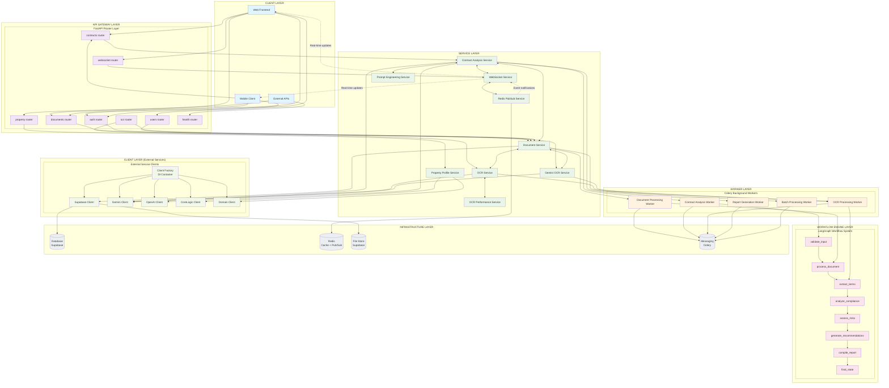

# Real2.AI Service Architecture

This document contains the comprehensive service architecture diagram for the Real2.AI platform, showing how routers/workers consume services, inter-service communication patterns, and client interactions.

## Architecture Overview

The Real2.AI platform follows a layered microservices-inspired architecture with clear separation of concerns:

- **Client Layer**: Web frontend, mobile clients, and external APIs
- **API Gateway Layer**: FastAPI routers handling HTTP requests
- **Service Layer**: Business logic and orchestration services
- **Worker Layer**: Celery background task processors
- **Workflow Engine Layer**: LangGraph-based contract analysis workflows
- **Client Layer**: External service integrations with factory pattern
- **Infrastructure Layer**: Database, caching, storage, and messaging

## Mermaid Architecture Diagram



## Communication Patterns

### Synchronous Communication (HTTP REST API)
- **Client ↔ API Gateway**: Standard HTTP request/response
- **API Gateway ↔ Services**: Direct service method calls
- **Services ↔ External Clients**: HTTP API calls with retry logic

### Asynchronous Communication (Background Tasks)
- **Services → Workers**: Celery task queue for heavy processing
- **Workers → Workflows**: LangGraph state-based execution
- **Workers → Infrastructure**: Database and storage operations

### Real-time Communication (WebSocket)
- **Services ↔ Clients**: Bidirectional real-time updates
- **Services ↔ Redis**: Pub/Sub for event distribution
- **Workers → Clients**: Progress notifications via WebSocket

### Event-driven Communication (Redis Pub/Sub)
- **Services → Services**: Event notifications
- **Workers → Services**: Status updates and results
- **System → Clients**: Real-time notifications

## Key Architectural Patterns

### 1. **Factory Pattern** (Client Layer)
- Centralized client creation and configuration
- Dependency injection for service integration
- Standardized error handling and retry logic

### 2. **Observer Pattern** (WebSocket System)
- Real-time event propagation
- Decoupled notification system
- Multi-client broadcast capabilities

### 3. **Command Pattern** (Background Workers)
- Asynchronous task execution
- Task queuing and scheduling
- Progress tracking and result handling

### 4. **State Pattern** (Workflow Engine)
- LangGraph-based state machine
- Sequential processing with error handling
- Progress tracking and recovery

### 5. **Singleton Pattern** (Service Managers)
- WebSocket connection management
- Database connection pooling
- Service registry and lifecycle

## Quality Attributes

### Scalability
- **Horizontal**: Multiple worker instances
- **Vertical**: Async processing and connection pooling
- **Load Distribution**: Celery task distribution

### Reliability
- **Error Handling**: Comprehensive retry mechanisms
- **Graceful Degradation**: Fallback strategies
- **Health Monitoring**: System health endpoints

### Performance
- **Caching**: Redis for frequent data access
- **Background Processing**: Non-blocking operations
- **Connection Pooling**: Efficient resource utilization

### Maintainability
- **Separation of Concerns**: Clear layer boundaries
- **Standardized Interfaces**: Consistent API patterns
- **Comprehensive Logging**: Full system observability

### Security
- **Authentication**: JWT-based auth system
- **Authorization**: Role-based access control
- **Data Protection**: Encrypted storage and transmission

## Data Flow Examples

### Document Upload and Analysis Flow
```
Client → Document Router → Document Service → Supabase Storage
                                ↓
Background Worker → OCR Service → Gemini Client
                                ↓
Contract Analysis Worker → LangGraph Workflow → AI Analysis
                                ↓
WebSocket Service → Real-time Updates → Client
```

### Property Profile Integration Flow
```
Client → Property Router → Property Profile Service → Domain/CoreLogic Client
                                ↓
External API → Data Processing → Database Storage
                                ↓
WebSocket Service → Results → Client
```

### Real-time Progress Updates Flow
```
Background Worker → Progress Update → Redis Pub/Sub
                                ↓
WebSocket Service → Event Handler → Connected Clients
```

This architecture provides a robust, scalable foundation for the Real2.AI Australian real estate contract analysis platform, with clear service boundaries, comprehensive error handling, and real-time user experience capabilities.