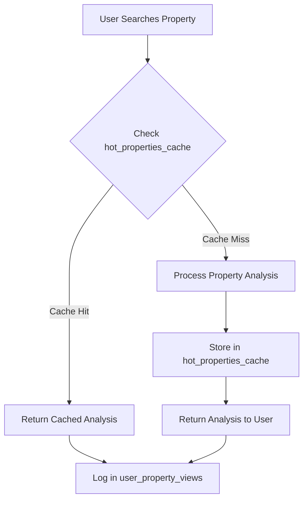
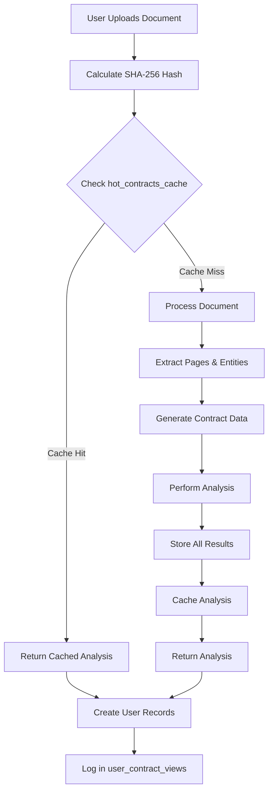

# Document Processing Cache Architecture

## Overview

This document outlines a high-performance caching strategy for document and contract analysis that eliminates duplicate processing while maintaining user privacy and data security.

## Problem Statement

### Use Cases Requiring Caching
1. **Property Research**: Multiple users analyzing same property addresses
2. **Property Open Days**: Mass contract analysis requests for same property contracts
3. **Popular Documents**: Frequently requested contract analysis

### Performance Goals
- Eliminate duplicate token usage for identical content
- Provide instant responses for cached analysis
- Maintain user privacy and data ownership
- Support user access history

## Architecture Design

### Core Principles
1. **User Privacy**: Raw uploads remain private to the user
2. **Shared Intelligence**: Processed insights can be shared across users
3. **Content-Based Caching**: Cache by content hash, not user ownership
4. **No Referential Constraints**: Use hash-based relationships instead of foreign keys

### Security Model

#### High Sensitivity (RLS Enabled)
- User owns their uploads and upload metadata
- Cannot access other users' upload records

#### Shareable Derived Data (No RLS)
- Processed content is community shareable
- Analysis results available to all users with same content
- Optimizes token usage and performance

## Database Schema

### User-Owned Tables (With RLS)

```sql
-- User document uploads (Private)
CREATE TABLE documents (
    id UUID PRIMARY KEY DEFAULT gen_random_uuid(),
    user_id UUID NOT NULL REFERENCES auth.users(id),
    content_hash TEXT NOT NULL, -- SHA-256 of document content
    filename TEXT NOT NULL,
    file_size INTEGER NOT NULL,
    mime_type TEXT NOT NULL,
    uploaded_at TIMESTAMP DEFAULT NOW()
);

-- Enable RLS
ALTER TABLE documents ENABLE ROW LEVEL SECURITY;

-- RLS Policy: Users can only see their own documents
CREATE POLICY "Users can view own documents" ON documents 
    FOR ALL USING (auth.uid() = user_id);

-- User property search history (Private)
CREATE TABLE user_property_views (
    id UUID PRIMARY KEY DEFAULT gen_random_uuid(),
    user_id UUID NOT NULL REFERENCES auth.users(id),
    property_hash TEXT NOT NULL,
    property_address TEXT NOT NULL,
    viewed_at TIMESTAMP DEFAULT NOW()
);

-- Enable RLS
ALTER TABLE user_property_views ENABLE ROW LEVEL SECURITY;

-- RLS Policy: Users can only see their own views
CREATE POLICY "Users can view own property history" ON user_property_views 
    FOR ALL USING (auth.uid() = user_id);

-- User contract analysis history (Private)
CREATE TABLE user_contract_views (
    id UUID PRIMARY KEY DEFAULT gen_random_uuid(),
    user_id UUID NOT NULL REFERENCES auth.users(id),
    content_hash TEXT NOT NULL,
    property_address TEXT,
    analysis_id UUID, -- References contract_analyses
    viewed_at TIMESTAMP DEFAULT NOW(),
    source TEXT CHECK (source IN ('upload', 'cache_hit'))
);

-- Enable RLS
ALTER TABLE user_contract_views ENABLE ROW LEVEL SECURITY;

-- RLS Policy: Users can only see their own contract views
CREATE POLICY "Users can view own contract history" ON user_contract_views 
    FOR ALL USING (auth.uid() = user_id);
```

### Shared Data Tables (No RLS, Hash-Based)

```sql
-- Extracted document pages (Shared)
CREATE TABLE document_pages (
    id UUID PRIMARY KEY DEFAULT gen_random_uuid(),
    content_hash TEXT NOT NULL, -- Links to document content
    page_number INTEGER NOT NULL,
    extracted_text TEXT NOT NULL,
    created_at TIMESTAMP DEFAULT NOW(),
    UNIQUE(content_hash, page_number)
);

-- Extracted document entities (Shared)
CREATE TABLE document_entities (
    id UUID PRIMARY KEY DEFAULT gen_random_uuid(),
    content_hash TEXT NOT NULL, -- Links to document content
    entity_type TEXT NOT NULL, -- 'person', 'date', 'amount', etc.
    entity_value TEXT NOT NULL,
    confidence_score DECIMAL(3,2),
    page_number INTEGER,
    created_at TIMESTAMP DEFAULT NOW()
);

-- Structured contract data (Shared)
CREATE TABLE contracts (
    id UUID PRIMARY KEY DEFAULT gen_random_uuid(),
    content_hash TEXT NOT NULL UNIQUE, -- Links to document content
    contract_type TEXT,
    property_address TEXT,
    purchase_price DECIMAL,
    settlement_date DATE,
    special_conditions JSONB,
    extracted_clauses JSONB,
    created_at TIMESTAMP DEFAULT NOW()
);

-- Contract analysis results (Shared)
CREATE TABLE contract_analyses (
    id UUID PRIMARY KEY DEFAULT gen_random_uuid(),
    content_hash TEXT NOT NULL, -- Links to document content
    analysis_result JSONB NOT NULL,
    risk_score INTEGER,
    key_findings JSONB,
    recommendations JSONB,
    analyzed_at TIMESTAMP DEFAULT NOW(),
    UNIQUE(content_hash)
);

-- Hot properties cache (Shared, TTL)
CREATE TABLE hot_properties_cache (
    id UUID PRIMARY KEY DEFAULT gen_random_uuid(),
    property_hash TEXT NOT NULL UNIQUE, -- Hash of normalized address
    property_address TEXT NOT NULL,
    analysis_result JSONB NOT NULL,
    popularity_score INTEGER DEFAULT 1,
    expires_at TIMESTAMP NOT NULL,
    created_at TIMESTAMP DEFAULT NOW()
);

-- Hot contracts cache (Shared, TTL)
CREATE TABLE hot_contracts_cache (
    id UUID PRIMARY KEY DEFAULT gen_random_uuid(),
    content_hash TEXT NOT NULL UNIQUE,
    contract_analysis JSONB NOT NULL,
    property_address TEXT,
    access_count INTEGER DEFAULT 1,
    expires_at TIMESTAMP NOT NULL,
    created_at TIMESTAMP DEFAULT NOW()
);
```

### Indexes for Performance

```sql
-- Document lookup indexes
CREATE INDEX idx_documents_user_id ON documents(user_id);
CREATE INDEX idx_documents_content_hash ON documents(content_hash);

-- Hash-based lookup indexes
CREATE INDEX idx_document_pages_hash ON document_pages(content_hash);
CREATE INDEX idx_document_entities_hash ON document_entities(content_hash);
CREATE INDEX idx_contracts_hash ON contracts(content_hash);
CREATE INDEX idx_contract_analyses_hash ON contract_analyses(content_hash);

-- Cache lookup indexes
CREATE INDEX idx_hot_properties_hash ON hot_properties_cache(property_hash);
CREATE INDEX idx_hot_contracts_hash ON hot_contracts_cache(content_hash);
CREATE INDEX idx_cache_expires ON hot_properties_cache(expires_at);
CREATE INDEX idx_contracts_cache_expires ON hot_contracts_cache(expires_at);

-- User history indexes
CREATE INDEX idx_user_property_views_user ON user_property_views(user_id);
CREATE INDEX idx_user_contract_views_user ON user_contract_views(user_id);
```

## Processing Flows

### Flow 1: Property Research (Address-Based Caching)



#### Implementation Steps:
1. **User Input**: Property address search
2. **Cache Check**: Query `hot_properties_cache` with normalized address hash
3. **Cache Hit**: Return cached analysis + log view
4. **Cache Miss**: Process analysis → Store in cache → Return result + log view

### Flow 2: Document Analysis (Content-Based Caching)



#### Implementation Steps:
1. **Upload**: User uploads document → Store in `documents` (RLS)
2. **Hash**: Calculate SHA-256 of document content
3. **Cache Check**: Query `hot_contracts_cache` with content hash
4. **Cache Hit Path**:
   - Return cached analysis immediately
   - Async: Create user's document record + derived records
   - Log in `user_contract_views`
5. **Cache Miss Path**:
   - Process document → Extract pages, entities, contract data
   - Perform analysis → Store in shared tables
   - Cache analysis with TTL → Return result
   - Log in `user_contract_views`

## Service Role Operations

### Background Tasks (Bypass RLS)

```sql
-- Service role function for cache hit processing
CREATE OR REPLACE FUNCTION process_cache_hit(
    p_user_id UUID,
    p_content_hash TEXT,
    p_filename TEXT,
    p_file_size INTEGER,
    p_mime_type TEXT,
    p_property_address TEXT DEFAULT NULL
) RETURNS UUID
LANGUAGE plpgsql
SECURITY DEFINER -- Run with elevated privileges
AS $$
DECLARE
    new_doc_id UUID;
    analysis_id UUID;
BEGIN
    -- Create user's document record
    INSERT INTO documents (user_id, content_hash, filename, file_size, mime_type)
    VALUES (p_user_id, p_content_hash, p_filename, p_file_size, p_mime_type)
    RETURNING id INTO new_doc_id;
    
    -- Get analysis ID
    SELECT id INTO analysis_id FROM contract_analyses 
    WHERE content_hash = p_content_hash;
    
    -- Log user's contract view
    INSERT INTO user_contract_views (user_id, content_hash, property_address, analysis_id, source)
    VALUES (p_user_id, p_content_hash, p_property_address, analysis_id, 'cache_hit');
    
    RETURN new_doc_id;
END;
$$;
```

## Cache Management

### TTL Strategy

```sql
-- Property cache: 1-3 days (market data freshness)
hot_properties_cache.expires_at = NOW() + INTERVAL '2 days';

-- Contract cache: 1-3 days (analysis relevance)
hot_contracts_cache.expires_at = NOW() + INTERVAL '1 day';
```

### Cache Cleanup

```sql
-- Automated cleanup function
CREATE OR REPLACE FUNCTION cleanup_expired_cache()
RETURNS INTEGER
LANGUAGE plpgsql
AS $$
DECLARE
    deleted_count INTEGER;
BEGIN
    -- Clean property cache
    DELETE FROM hot_properties_cache WHERE expires_at < NOW();
    GET DIAGNOSTICS deleted_count = ROW_COUNT;
    
    -- Clean contract cache
    DELETE FROM hot_contracts_cache WHERE expires_at < NOW();
    GET DIAGNOSTICS deleted_count = deleted_count + ROW_COUNT;
    
    RETURN deleted_count;
END;
$$;

-- Schedule cleanup (run every hour)
SELECT cron.schedule('cache-cleanup', '0 * * * *', 'SELECT cleanup_expired_cache();');
```

### Popularity Tracking

```sql
-- Update popularity on access
UPDATE hot_properties_cache 
SET popularity_score = popularity_score + 1,
    expires_at = GREATEST(expires_at, NOW() + INTERVAL '2 days') -- Extend popular items
WHERE property_hash = $1;

UPDATE hot_contracts_cache 
SET access_count = access_count + 1,
    expires_at = GREATEST(expires_at, NOW() + INTERVAL '1 day')
WHERE content_hash = $1;
```

## API Implementation

### Property Search Endpoint

```typescript
async function searchProperty(address: string, userId: string) {
    const propertyHash = sha256(normalizeAddress(address));
    
    // Check cache first
    const cached = await supabase
        .from('hot_properties_cache')
        .select('*')
        .eq('property_hash', propertyHash)
        .gt('expires_at', new Date().toISOString())
        .single();
    
    if (cached.data) {
        // Cache hit - log view and return
        await supabase
            .from('user_property_views')
            .insert({
                user_id: userId,
                property_hash: propertyHash,
                property_address: address
            });
        
        // Update popularity
        await supabase.rpc('increment_property_popularity', { 
            hash: propertyHash 
        });
        
        return cached.data.analysis_result;
    }
    
    // Cache miss - process and cache
    const analysis = await processPropertyAnalysis(address);
    
    await supabase
        .from('hot_properties_cache')
        .upsert({
            property_hash: propertyHash,
            property_address: address,
            analysis_result: analysis,
            expires_at: new Date(Date.now() + 2 * 24 * 60 * 60 * 1000) // 2 days
        });
    
    // Log view
    await supabase
        .from('user_property_views')
        .insert({
            user_id: userId,
            property_hash: propertyHash,
            property_address: address
        });
    
    return analysis;
}
```

### Document Analysis Endpoint

```typescript
async function analyzeDocument(file: File, userId: string) {
    const content = await file.arrayBuffer();
    const contentHash = await sha256(content);
    
    // Check cache first
    const cached = await supabase
        .from('hot_contracts_cache')
        .select('*')
        .eq('content_hash', contentHash)
        .gt('expires_at', new Date().toISOString())
        .single();
    
    if (cached.data) {
        // Cache hit - return immediately, process user records async
        setImmediate(async () => {
            await supabase.rpc('process_cache_hit', {
                p_user_id: userId,
                p_content_hash: contentHash,
                p_filename: file.name,
                p_file_size: file.size,
                p_mime_type: file.type
            });
        });
        
        return cached.data.contract_analysis;
    }
    
    // Cache miss - full processing pipeline
    const documentId = await storeDocument(file, userId, contentHash);
    const pages = await extractPages(content, contentHash);
    const entities = await extractEntities(content, contentHash);
    const contract = await extractContractData(content, contentHash);
    const analysis = await analyzeContract(contract, contentHash);
    
    // Cache the analysis
    await supabase
        .from('hot_contracts_cache')
        .upsert({
            content_hash: contentHash,
            contract_analysis: analysis,
            property_address: contract.property_address,
            expires_at: new Date(Date.now() + 24 * 60 * 60 * 1000) // 1 day
        });
    
    // Log user view
    await supabase
        .from('user_contract_views')
        .insert({
            user_id: userId,
            content_hash: contentHash,
            analysis_id: analysis.id,
            source: 'upload'
        });
    
    return analysis;
}
```

## Benefits

### Performance Benefits
- **Token Savings**: 60-90% reduction in duplicate processing
- **Response Time**: Sub-second responses for cached content
- **Scalability**: Handles property open day traffic spikes
- **Cost Efficiency**: Major reduction in AI processing costs

### User Experience Benefits
- **Instant Results**: Immediate responses for popular content
- **Access History**: Users can review their search/analysis history
- **Future Access**: Permanent access to analysis results
- **Privacy Protection**: User uploads remain private

### Technical Benefits
- **Clean Architecture**: Clear separation of concerns
- **No FK Constraints**: Eliminates complex cascade issues  
- **Content-Based Logic**: More intuitive than user-based relationships
- **Cache Efficiency**: Intelligent TTL and popularity tracking

## Migration Strategy

### Phase 1: Schema Migration
1. Create new hash-based tables
2. Migrate existing data to content-hash relationships
3. Remove old foreign key constraints
4. Create new indexes

### Phase 2: Application Updates
1. Update API endpoints to use cache-first strategy
2. Implement service role functions
3. Add cache management utilities
4. Update user history interfaces

### Phase 3: Optimization
1. Fine-tune TTL values based on usage patterns
2. Implement advanced popularity algorithms
3. Add monitoring and alerting
4. Performance optimization based on metrics

## Monitoring & Metrics

### Key Performance Indicators
- **Cache Hit Rate**: Target >70% for contracts, >80% for properties
- **Token Usage Reduction**: Track savings vs non-cached baseline
- **Response Time**: <500ms for cache hits, <5s for cache misses
- **Storage Usage**: Monitor cache table growth and cleanup efficiency

### Alerting Thresholds
- Cache hit rate drops below 50%
- Cache cleanup failures
- Unusually high cache storage usage
- Service role function failures

## Security Considerations

### Data Privacy
- User uploads remain strictly private (RLS enforced)
- Derived data sharing follows opt-in model
- Content hashes provide anonymization layer
- Audit logging for compliance requirements

### Access Control
- Service role functions use SECURITY DEFINER pattern
- Cache access requires authenticated user context
- User history tables maintain strict RLS policies
- Regular security audits of shared data exposure

## Conclusion

This architecture provides an optimal balance between performance optimization and data privacy. By separating user ownership (private uploads) from community intelligence (shared analysis), we achieve significant cost savings and performance improvements while maintaining user trust and regulatory compliance.

The hash-based relationship model eliminates complex foreign key constraints while providing intuitive content-based caching. This design scales efficiently for high-traffic scenarios like property open days while preserving individual user privacy and access history.