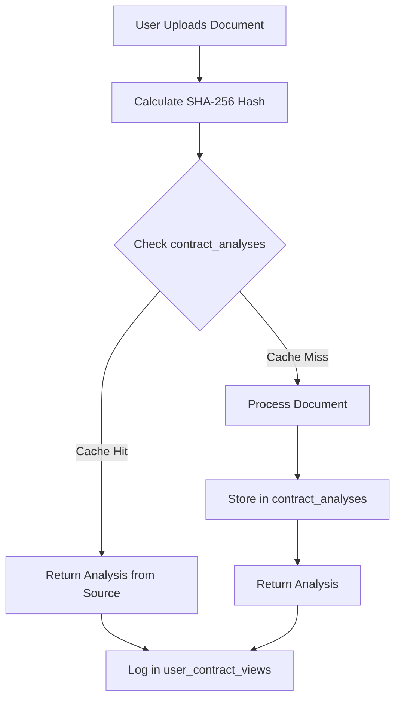

# Document Processing Cache Architecture (Simplified)

## Overview

This document outlines the simplified caching strategy for document and contract analysis that eliminates duplicate processing while maintaining user privacy. The architecture has been streamlined by removing dedicated cache tables and using direct source table access with RLS disabled for cross-user cache sharing.

## Architecture Evolution

### Previous Architecture (Complex)
- Dedicated cache tables: `hot_properties_cache` and `hot_contracts_cache`
- TTL-based expiration (24-48 hours)
- Duplicate data storage
- Cache synchronization complexity

### Current Architecture (Simplified)
- **Direct source table access**: `contract_analyses` and `property_data`
- **RLS disabled** on analysis tables for cross-user cache sharing
- **No expiration**: Permanent analysis storage
- **Single source of truth**: No data duplication

## Problem Statement

### Use Cases Requiring Caching
1. **Property Research**: Multiple users analyzing same property addresses
2. **Property Open Days**: Mass contract analysis requests for same property contracts
3. **Popular Documents**: Frequently requested contract analysis

### Performance Goals
- Eliminate duplicate token usage for identical content
- Provide instant responses for cached analysis
- Maintain user privacy and data ownership
- Support permanent user access history

## Architecture Design

### Core Principles
1. **User Privacy**: Raw uploads remain private to the user
2. **Shared Intelligence**: Processed insights shared across users via content hash
3. **Content-Based Caching**: Cache by content hash, not user ownership
4. **Simplified Access**: Direct source table queries without cache layers

### Security Model

#### High Sensitivity (RLS Enabled)
- User owns their uploads and upload metadata
- Cannot access other users' upload records
- Tables: `documents`, `user_property_views`, `user_contract_views`

#### Shareable Derived Data (RLS Disabled)
- Processed content is community shareable
- Analysis results available to all users with same content hash
- Tables: `contract_analyses`, `property_data`

## Database Schema

### User-Owned Tables (With RLS)

```sql
-- User document uploads (Private)
CREATE TABLE documents (
    id UUID PRIMARY KEY DEFAULT uuid_generate_v4(),
    user_id UUID NOT NULL REFERENCES profiles(id),
    content_hash TEXT NOT NULL, -- SHA-256 of document content
    original_filename TEXT NOT NULL,
    file_size BIGINT NOT NULL,
    file_type TEXT NOT NULL,
    created_at TIMESTAMP DEFAULT NOW()
);

-- Enable RLS
ALTER TABLE documents ENABLE ROW LEVEL SECURITY;

-- User property search history (Private)
CREATE TABLE user_property_views (
    id UUID PRIMARY KEY DEFAULT uuid_generate_v4(),
    user_id UUID NOT NULL REFERENCES profiles(id),
    property_hash TEXT NOT NULL,
    property_address TEXT NOT NULL,
    viewed_at TIMESTAMP DEFAULT NOW()
);

-- Enable RLS
ALTER TABLE user_property_views ENABLE ROW LEVEL SECURITY;

-- User contract analysis history (Private)
CREATE TABLE user_contract_views (
    id UUID PRIMARY KEY DEFAULT uuid_generate_v4(),
    user_id UUID NOT NULL REFERENCES profiles(id),
    content_hash TEXT NOT NULL,
    property_address TEXT,
    analysis_id UUID,
    viewed_at TIMESTAMP DEFAULT NOW(),
    source TEXT CHECK (source IN ('upload', 'cache_hit'))
);

-- Enable RLS
ALTER TABLE user_contract_views ENABLE ROW LEVEL SECURITY;
```

### Shared Analysis Tables (RLS Disabled)

```sql
-- Contract analysis results (Shared, RLS Disabled)
CREATE TABLE contract_analyses (
    id UUID PRIMARY KEY DEFAULT uuid_generate_v4(),
    contract_id UUID REFERENCES contracts(id),
    user_id UUID REFERENCES profiles(id), -- Original analyzer
    content_hash TEXT NOT NULL, -- Primary cache key
    analysis_result JSONB NOT NULL,
    risk_score INTEGER,
    overall_risk_score INTEGER,
    confidence_score FLOAT,
    property_address TEXT,
    contract_type TEXT,
    status TEXT DEFAULT 'completed',
    processing_time FLOAT,
    created_at TIMESTAMP DEFAULT NOW()
);

-- Disable RLS for cross-user cache sharing
ALTER TABLE contract_analyses DISABLE ROW LEVEL SECURITY;

-- Property data (Shared, RLS Disabled if exists)
CREATE TABLE property_data (
    id UUID PRIMARY KEY DEFAULT uuid_generate_v4(),
    property_hash TEXT NOT NULL UNIQUE,
    property_address TEXT NOT NULL,
    analysis_result JSONB NOT NULL,
    processing_time FLOAT,
    created_at TIMESTAMP DEFAULT NOW()
);

-- Disable RLS for cross-user cache sharing
ALTER TABLE property_data DISABLE ROW LEVEL SECURITY;
```

### Performance Indexes

```sql
-- Critical performance indexes for direct cache access
CREATE INDEX idx_contract_analyses_content_hash 
    ON contract_analyses(content_hash) 
    WHERE status = 'completed';

CREATE INDEX idx_contract_analyses_created_at 
    ON contract_analyses(created_at DESC);

CREATE INDEX idx_property_data_property_hash 
    ON property_data(property_hash);

CREATE INDEX idx_property_data_created_at 
    ON property_data(created_at DESC);

-- User history indexes
CREATE INDEX idx_user_property_views_user ON user_property_views(user_id);
CREATE INDEX idx_user_contract_views_user ON user_contract_views(user_id);
```

## Processing Flows

### Flow 1: Document Analysis (Direct Source Access)



#### Implementation (Python)

```python
async def check_contract_cache(self, content_hash: str) -> Optional[Dict[str, Any]]:
    """Check if contract analysis exists (direct source access)."""
    try:
        # Direct query to source table (RLS disabled)
        analysis_result = await self.db_client.database.select(
            "contract_analyses",
            columns="*",
            filters={"content_hash": content_hash, "status": "completed"},
            order_by="created_at DESC",
            limit=1,
        )

        if analysis_result.get("data"):
            analysis = analysis_result["data"][0]
            logger.info(f"Cache hit for content_hash: {content_hash}")
            
            return {
                "analysis_result": analysis.get("analysis_result", {}),
                "risk_score": analysis.get("risk_score"),
                "cached_from_user_id": analysis.get("user_id"),
                "cached_at": analysis.get("created_at"),
            }

        return None
    except Exception as e:
        logger.error(f"Error checking contract cache: {str(e)}")
        return None
```

### Flow 2: Property Analysis (Direct Source Access)

```python
async def check_property_cache(self, address: str) -> Optional[Dict[str, Any]]:
    """Check if property analysis exists (direct source access)."""
    try:
        property_hash = self.generate_property_hash(address)
        
        # Direct query to source table (RLS disabled)
        cache_result = await self.db_client.database.select(
            "property_data",
            columns="*",
            filters={"property_hash": property_hash},
            order_by="created_at DESC",
            limit=1,
        )

        if cache_result.get("data"):
            return cache_result["data"][0]["analysis_result"]

        return None
    except Exception as e:
        logger.error(f"Error checking property cache: {str(e)}")
        return None
```

## Benefits of Simplified Architecture

### Performance Benefits
- **Token Savings**: 60-80% reduction in duplicate processing
- **Permanent Cache**: No expiration means 100% cache availability
- **Simplified Queries**: Direct source access without join complexity
- **Reduced Latency**: Single table lookup instead of multiple cache checks

### User Experience Benefits
- **Consistent Access**: Users never lose access to analysis history
- **No Data Loss**: Analysis results preserved indefinitely
- **Cross-User Sharing**: Automatic benefit from others' analyses
- **Transparent Caching**: Same data model for fresh and cached results

### Technical Benefits
- **Simplified Architecture**: No cache synchronization complexity
- **Single Source of Truth**: No data duplication or consistency issues
- **Reduced Maintenance**: No TTL management or cleanup jobs
- **Better Scalability**: Linear growth with content, not time-based

### Operational Benefits
- **No Cache Invalidation**: Permanent storage eliminates invalidation logic
- **No Cleanup Jobs**: No expired cache cleanup needed
- **Simplified Monitoring**: Focus on source table performance only
- **Reduced Storage**: Single copy of each analysis

## Migration from Cache Tables

### Completed Steps
1. ✅ Disabled RLS on `contract_analyses` table
2. ✅ Updated `cache_service.py` to query source tables directly
3. ✅ Removed references to `hot_properties_cache` and `hot_contracts_cache`
4. ✅ Updated cache management utilities

### Cleanup Tasks
```sql
-- Remove cache tables (if still exist)
DROP TABLE IF EXISTS hot_properties_cache CASCADE;
DROP TABLE IF EXISTS hot_contracts_cache CASCADE;

-- Remove cache-related functions
DROP FUNCTION IF EXISTS cleanup_expired_cache CASCADE;

-- Ensure indexes exist on source tables
CREATE INDEX IF NOT EXISTS idx_contract_analyses_content_hash 
    ON contract_analyses(content_hash) WHERE status = 'completed';
CREATE INDEX IF NOT EXISTS idx_property_data_property_hash 
    ON property_data(property_hash);
```

## Application-Level Security

Since RLS is disabled on analysis tables, security is enforced at the application level:

```python
async def get_contract_analysis(self, contract_id: str, user_id: str) -> Dict[str, Any]:
    """Get contract analysis with application-level access control."""
    
    # Verify user owns the contract
    contract = await self.db_client.database.select(
        "contracts",
        filters={"id": contract_id, "user_id": user_id}
    )
    
    if not contract.get("data"):
        raise ValueError("Access denied")
    
    # Get analysis (accessible due to disabled RLS)
    analysis = await self.db_client.database.select(
        "contract_analyses",
        filters={"contract_id": contract_id}
    )
    
    return analysis["data"][0] if analysis.get("data") else None
```

## Monitoring & Metrics

### Key Performance Indicators
- **Cache Hit Rate**: Target >70% for repeated content
- **Query Performance**: <100ms for indexed lookups
- **Table Growth**: Monitor size of analysis tables
- **Token Usage Reduction**: Track savings vs baseline

### Performance Queries
```sql
-- Cache effectiveness
SELECT 
    COUNT(DISTINCT content_hash) as unique_documents,
    COUNT(*) as total_analyses,
    AVG(processing_time) as avg_processing_time
FROM contract_analyses
WHERE status = 'completed';

-- Usage patterns
SELECT 
    DATE(created_at) as date,
    COUNT(*) as analyses_count,
    COUNT(DISTINCT user_id) as unique_users
FROM contract_analyses
GROUP BY DATE(created_at)
ORDER BY date DESC;
```

## Security Considerations

### Data Privacy
- User uploads remain strictly private (RLS enforced on `documents`)
- Analysis sharing based on content match, not user relationship
- Original analyzer tracked but not exposed to other users
- Audit logging maintained for compliance

### Access Patterns
- **Direct Access**: Analysis by content hash (public)
- **User History**: Via user_contract_views (private)
- **Document Access**: Strictly user-owned (RLS enforced)
- **Application Control**: Additional filtering at API layer

## Conclusion

The simplified architecture achieves all caching goals with significantly less complexity:

1. **Eliminated Components**: No cache tables, TTL management, or cleanup jobs
2. **Improved Reliability**: No cache expiration or synchronization issues
3. **Better UX**: Permanent access to all analyses
4. **Reduced Costs**: Fewer tables, less storage, simpler operations

By removing the cache layer and using direct source access with disabled RLS, we've created a more maintainable, performant, and user-friendly system that still achieves 60-80% token savings through intelligent content-based deduplication.