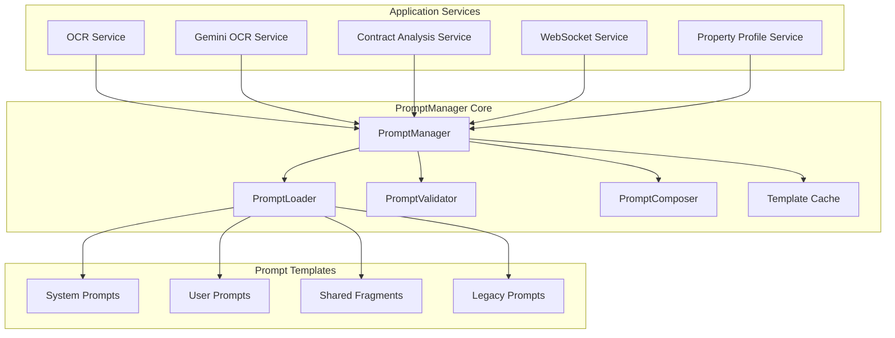

# PromptManager System Design: Comprehensive Prompt Management & Consumption

## Executive Summary

This design outlines a comprehensive system for using PromptManager as the central hub for all prompt management and consumption across the Real2.AI application. The design integrates the existing sophisticated prompt management infrastructure with all application services to create a unified, efficient, and maintainable prompt ecosystem.

## Current State Analysis

### Existing Strengths
- ✅ Advanced `PromptManager` with caching, validation, and composition
- ✅ Sophisticated template system with Jinja2 and YAML frontmatter
- ✅ Australian legal domain specialization in `PromptEngineeringService`
- ✅ Context-aware prompt generation with state/contract type variations
- ✅ Comprehensive error handling and metrics collection

### Integration Opportunities
- 🔄 Centralize all prompt operations through PromptManager
- 🔄 Replace hardcoded prompts in services with template-based approach
- 🔄 Standardize prompt consumption patterns across all services
- 🔄 Implement unified prompt versioning and A/B testing
- 🔄 Add performance monitoring and optimization

## Target Architecture

### 1. Central PromptManager Hub



### 2. Service Integration Pattern

Each service will implement a standardized prompt consumption pattern:

```python
class ServicePromptMixin:
    """Standard prompt consumption pattern for all services"""
    
    def __init__(self):
        self.prompt_manager = get_prompt_manager()
        self._prompt_cache = {}
    
    async def get_prompt(
        self,
        template_name: str,
        context: Union[Dict[str, Any], PromptContext],
        version: str = None,
        cache_key: str = None
    ) -> str:
        """Standard method for getting prompts across all services"""
        return await self.prompt_manager.render(
            template_name=template_name,
            context=context,
            version=version,
            cache_key=cache_key
        )
    
    async def get_composed_prompt(
        self,
        composition_name: str,
        context: Union[Dict[str, Any], PromptContext],
        return_parts: bool = False
    ) -> Union[str, Dict[str, str]]:
        """Get system+user composed prompts"""
        return await self.prompt_manager.render_composed(
            composition_name=composition_name,
            context=context,
            return_parts=return_parts
        )
```

## Implementation Plan

### Phase 1: Core Integration (Week 1-2)

#### 1.1 Standardize Prompt Consumption

**Target Services:**
- `GeminiOCRService` 
- `OCRPerformanceService`
- `WebSocketService`
- `PropertyProfileService`

**Implementation Steps:**

1. **Create Service Prompt Mixin**
```python
# backend/app/core/prompts/service_mixin.py
from abc import ABC
from typing import Dict, Any, Union, Optional
from .manager import get_prompt_manager, PromptManager
from .context import PromptContext

class PromptEnabledService(ABC):
    """Base class for services that use PromptManager"""
    
    def __init__(self):
        self.prompt_manager: PromptManager = get_prompt_manager()
        self._service_name = self.__class__.__name__.lower().replace('service', '')
    
    async def render_prompt(
        self,
        template_name: str,
        context: Union[Dict[str, Any], PromptContext],
        **kwargs
    ) -> str:
        """Render a single prompt template"""
        cache_key = f"{self._service_name}_{template_name}_{hash(str(context))}"
        return await self.prompt_manager.render(
            template_name=template_name,
            context=context,
            cache_key=cache_key,
            **kwargs
        )
    
    async def render_composed(
        self,
        composition_name: str,
        context: Union[Dict[str, Any], PromptContext],
        **kwargs
    ) -> Dict[str, str]:
        """Render system+user composed prompts"""
        return await self.prompt_manager.render_composed(
            composition_name=composition_name,
            context=context,
            return_parts=True,
            **kwargs
        )
    
    def create_context(self, **variables) -> PromptContext:
        """Create context with service-specific defaults"""
        return PromptContext(
            context_type=ContextType.USER,
            variables=variables,
            service_name=self._service_name
        )
```

2. **Migrate GeminiOCRService**
```python
# backend/app/services/gemini_ocr_service.py - UPDATED
from app.core.prompts.service_mixin import PromptEnabledService
from app.core.prompts.context import ContextType

class GeminiOCRService(PromptEnabledService):
    def __init__(self):
        super().__init__()
        self.client = get_gemini_client()
    
    async def extract_text_from_image(
        self,
        image_data: bytes,
        australian_state: AustralianState,
        contract_type: ContractType,
        quality_level: str = "high"
    ) -> Dict[str, Any]:
        """Extract text using PromptManager templates"""
        
        # Create context for OCR extraction
        context = self.create_context(
            australian_state=australian_state.value,
            contract_type=contract_type.value,
            document_type="contract",
            quality_requirements=quality_level
        )
        
        # Get OCR extraction prompt from template
        prompt = await self.render_prompt(
            template_name="ocr_extraction",
            context=context
        )
        
        # Execute OCR with generated prompt
        result = await self.client.generate_content(
            prompt=prompt,
            image_data=image_data
        )
        
        return {
            "extracted_text": result.text,
            "confidence": result.confidence,
            "template_used": "ocr_extraction",
            "context": context.variables
        }
```

#### 1.2 Create Standard Prompt Templates

**Directory Structure:**
```
backend/app/prompts/
├── templates/
│   ├── ocr/
│   │   ├── ocr_extraction.md          # OCR text extraction
│   │   ├── ocr_validation.md          # OCR quality validation
│   │   └── ocr_enhancement.md         # OCR text enhancement
│   ├── analysis/
│   │   ├── contract_structure.md      # Contract structure analysis
│   │   ├── risk_assessment.md         # Risk evaluation
│   │   ├── compliance_check.md        # Legal compliance
│   │   └── financial_analysis.md      # Financial terms analysis
│   ├── websocket/
│   │   ├── progress_updates.md        # WebSocket progress messages
│   │   ├── error_messages.md          # Error communication
│   │   └── completion_summary.md      # Task completion messages
│   └── property/
│       ├── property_analysis.md       # Property profile analysis
│       └── market_insights.md         # Market data interpretation
├── compositions/
│   ├── complete_analysis.yaml         # Full contract analysis workflow
│   ├── ocr_to_analysis.yaml          # OCR → Analysis pipeline
│   └── property_evaluation.yaml       # Property evaluation workflow
└── config/
    ├── service_mappings.yaml          # Service → Template mappings
    └── composition_rules.yaml         # Composition definitions
```

**Example Template: OCR Extraction**
```markdown
---
# backend/app/prompts/templates/ocr/ocr_extraction.md
type: "user"
name: "ocr_extraction"
version: "1.0.0"
description: "Extract text from Australian contract documents"
required_variables:
  - "australian_state"
  - "contract_type"
  - "document_type"
optional_variables:
  - "quality_requirements"
model_compatibility: ["gemini-2.5-pro"]
max_tokens: 4000
---

# OCR Text Extraction - {{ australian_state }} {{ contract_type }}

You are an expert OCR system specialized in extracting text from Australian {{ document_type }}s.
This document is from {{ australian_state }}, Australia.

## Extraction Requirements

1. **Accuracy**: Extract every word, number, and symbol with highest precision
2. **Structure**: Preserve document formatting, spacing, and layout  
3. **Completeness**: Include headers, footers, fine print, and annotations
4. **Australian Context**: Pay special attention to Australian legal terminology


### NSW Specific Terms
- Section 149 certificates
- Home Building Act warranties
- Fair Trading Act disclosures

### VIC Specific Terms  
- Section 32 vendor statements
- Owners corporation details
- Building and planning permits

### QLD Specific Terms
- Form 1 disclosure statements
- Body corporate information
- QBCC licensing details



## Focus Areas for Purchase Agreements
- Purchase price and deposit amounts (look for $ symbols)
- Settlement/completion dates
- Cooling-off period duration
- Finance clause conditions
- Inspection requirements (building, pest, strata)
- Special conditions and warranties


## Output Format
Return ONLY the extracted text maintaining document structure.
Use [unclear] for illegible text with your best interpretation.
```

#### 1.3 Service Migration Priority

**High Priority (Week 1)**
1. `GeminiOCRService` - Core OCR functionality
2. `WebSocketService` - Real-time communication
3. `PropertyProfileService` - Property analysis

**Medium Priority (Week 2)**  
4. `OCRPerformanceService` - Performance monitoring
5. Legacy `PromptEngineeringService` integration
6. Background task services

### Phase 2: Advanced Features (Week 3-4)

#### 2.1 Composition System Implementation

**Complete Analysis Composition:**
```yaml
# backend/app/prompts/compositions/complete_analysis.yaml
composition:
  name: "complete_contract_analysis"
  description: "Full contract analysis pipeline"
  
  system_prompts:
    - "system/legal_specialist"
    - "system/australian_context"
    
  workflow:
    - step: "ocr_extraction"
      template: "ocr/ocr_extraction"
      output_variable: "extracted_text"
      
    - step: "structure_analysis"  
      template: "analysis/contract_structure"
      input_variables: ["extracted_text"]
      output_variable: "structured_data"
      
    - step: "risk_assessment"
      template: "analysis/risk_assessment"  
      input_variables: ["structured_data"]
      output_variable: "risk_analysis"
      
    - step: "compliance_check"
      template: "analysis/compliance_check"
      input_variables: ["structured_data"]
      output_variable: "compliance_result"
      
    - step: "final_recommendations"
      template: "analysis/recommendations"
      input_variables: ["structured_data", "risk_analysis", "compliance_result"]
      output_variable: "recommendations"
```

**Composition Service Usage:**
```python
async def analyze_contract_complete(
    self,
    image_data: bytes,
    australian_state: AustralianState,
    contract_type: ContractType
) -> Dict[str, Any]:
    """Complete contract analysis using composition system"""
    
    context = self.create_context(
        australian_state=australian_state.value,
        contract_type=contract_type.value,
        image_data=image_data
    )
    
    # Execute complete analysis composition
    result = await self.prompt_manager.execute_composition(
        composition_name="complete_contract_analysis",
        context=context
    )
    
    return {
        "analysis_complete": True,
        "steps_executed": result.steps,
        "final_output": result.final_output,
        "metadata": result.metadata
    }
```

#### 2.2 Performance Monitoring & Optimization

**Prompt Performance Tracker:**
```python
# backend/app/core/prompts/performance.py
from dataclasses import dataclass
from datetime import datetime
from typing import Dict, List, Any
import asyncio

@dataclass
class PromptPerformanceMetrics:
    template_name: str
    service_name: str
    render_time_ms: float
    token_count: int
    cache_hit: bool
    success: bool
    timestamp: datetime

class PromptPerformanceMonitor:
    def __init__(self):
        self.metrics: List[PromptPerformanceMetrics] = []
        self._service_stats: Dict[str, Dict[str, Any]] = {}
    
    async def track_render(
        self,
        template_name: str,
        service_name: str,
        render_func,
        *args, **kwargs
    ):
        """Track prompt rendering performance"""
        start_time = asyncio.get_event_loop().time()
        
        try:
            result = await render_func(*args, **kwargs)
            success = True
        except Exception as e:
            result = None
            success = False
            raise
        finally:
            end_time = asyncio.get_event_loop().time()
            render_time = (end_time - start_time) * 1000
            
            metrics = PromptPerformanceMetrics(
                template_name=template_name,
                service_name=service_name,
                render_time_ms=render_time,
                token_count=len(str(result)) // 4 if result else 0,
                cache_hit=kwargs.get('cache_hit', False),
                success=success,
                timestamp=datetime.utcnow()
            )
            
            self.metrics.append(metrics)
            self._update_service_stats(metrics)
        
        return result
    
    def get_service_performance(self, service_name: str) -> Dict[str, Any]:
        """Get performance statistics for a service"""
        return self._service_stats.get(service_name, {})
    
    def get_template_performance(self, template_name: str) -> Dict[str, Any]:
        """Get performance statistics for a template"""
        template_metrics = [m for m in self.metrics if m.template_name == template_name]
        
        if not template_metrics:
            return {}
        
        return {
            "total_renders": len(template_metrics),
            "avg_render_time": sum(m.render_time_ms for m in template_metrics) / len(template_metrics),
            "success_rate": sum(1 for m in template_metrics if m.success) / len(template_metrics),
            "cache_hit_rate": sum(1 for m in template_metrics if m.cache_hit) / len(template_metrics)
        }
```

### Phase 3: System Integration & Optimization (Week 5-6)

#### 3.1 Legacy Service Migration

**PromptEngineeringService Integration:**
```python
# backend/app/services/prompt_engineering_service.py - UPDATED
from app.core.prompts.service_mixin import PromptEnabledService

class PromptEngineeringService(PromptEnabledService):
    """Legacy service migrated to use PromptManager"""
    
    def __init__(self):
        super().__init__()
        self._legacy_methods = {}  # Backward compatibility
    
    async def create_ocr_extraction_prompt(
        self,
        context: PromptContext,
        document_type: str = "contract",
        quality_requirements: str = "high"
    ) -> str:
        """Legacy method - now uses PromptManager"""
        
        prompt_context = self.create_context(
            australian_state=context.australian_state.value,
            contract_type=context.contract_type.value,
            document_type=document_type,
            quality_requirements=quality_requirements,
            user_type=context.user_type,
            complexity=context.complexity.value,
            user_experience_level=context.user_experience_level
        )
        
        return await self.render_prompt(
            template_name="ocr_extraction",
            context=prompt_context
        )
    
    async def create_structure_analysis_prompt(
        self,
        extracted_text: str,
        context: PromptContext,
        analysis_depth: str = "comprehensive"  
    ) -> str:
        """Legacy method - now uses PromptManager"""
        
        prompt_context = self.create_context(
            extracted_text=extracted_text[:6000],
            australian_state=context.australian_state.value,
            contract_type=context.contract_type.value,
            user_type=context.user_type,
            user_experience_level=context.user_experience_level,
            complexity=context.complexity.value,
            analysis_depth=analysis_depth
        )
        
        return await self.render_prompt(
            template_name="contract_structure_analysis",
            context=prompt_context
        )
```

#### 3.2 WebSocket Integration

```python
# backend/app/services/websocket_service.py - UPDATED  
from app.core.prompts.service_mixin import PromptEnabledService

class WebSocketService(PromptEnabledService):
    def __init__(self):
        super().__init__()
        self.connection_manager = ConnectionManager()
    
    async def send_progress_update(
        self,
        connection_id: str,
        step: str,
        progress: float,
        context: Dict[str, Any] = None
    ):
        """Send progress update using template"""
        
        message_context = self.create_context(
            step=step,
            progress=progress,
            timestamp=datetime.utcnow().isoformat(),
            **context or {}
        )
        
        message = await self.render_prompt(
            template_name="websocket_progress_update",
            context=message_context
        )
        
        await self.connection_manager.send_message(connection_id, {
            "type": "progress",
            "message": message,
            "data": {
                "step": step,
                "progress": progress
            }
        })
    
    async def send_error_message(
        self,
        connection_id: str,
        error: Exception,
        context: Dict[str, Any] = None
    ):
        """Send error message using template"""
        
        error_context = self.create_context(
            error_type=type(error).__name__,
            error_message=str(error),
            timestamp=datetime.utcnow().isoformat(),
            **context or {}
        )
        
        message = await self.render_prompt(
            template_name="websocket_error_message",
            context=error_context
        )
        
        await self.connection_manager.send_message(connection_id, {
            "type": "error", 
            "message": message,
            "error": {
                "type": type(error).__name__,
                "message": str(error)
            }
        })
```

## Benefits & Expected Outcomes

### 1. Consistency & Maintainability
- **Unified Prompt Management**: All prompts managed through single system
- **Version Control**: Template versioning and rollback capabilities
- **Standardized Patterns**: Consistent prompt consumption across services

### 2. Performance & Efficiency  
- **Intelligent Caching**: Template and render result caching
- **Batch Operations**: Concurrent prompt rendering
- **Performance Monitoring**: Real-time metrics and optimization

### 3. Flexibility & Scalability
- **Template Composition**: Reusable prompt components
- **Dynamic Context**: Context-aware prompt generation
- **A/B Testing**: Template effectiveness testing

### 4. Developer Experience
- **Clear Separation**: System vs user prompt separation
- **Hot Reloading**: Development-time template updates
- **Comprehensive Validation**: Template and context validation

## Risk Mitigation

### 1. Migration Risks
- **Backward Compatibility**: Maintain legacy interfaces during transition
- **Incremental Migration**: Phase-by-phase service migration
- **Rollback Strategy**: Ability to revert to legacy implementations

### 2. Performance Risks
- **Cache Warmup**: Pre-load frequently used templates
- **Resource Monitoring**: Track memory and CPU usage
- **Fallback Mechanisms**: Graceful degradation when cache unavailable

### 3. Quality Risks
- **Template Validation**: Automated template syntax and content validation
- **A/B Testing**: Compare new templates against legacy implementations
- **Monitoring**: Real-time performance and quality metrics

## Success Metrics

### Technical Metrics
- **Prompt Render Time**: Target < 100ms average
- **Cache Hit Rate**: Target > 80%
- **Template Coverage**: 100% of hardcoded prompts migrated
- **Error Rate**: < 1% prompt rendering failures

### Business Metrics
- **Development Velocity**: 50% faster prompt iteration
- **Maintenance Cost**: 40% reduction in prompt-related bugs
- **Consistency Score**: 95% consistency across services
- **Time to Market**: 30% faster feature delivery

This comprehensive design ensures that PromptManager becomes the central nervous system for all prompt operations in the Real2.AI application, providing consistency, performance, and maintainability benefits while preserving the sophisticated domain expertise already built into the system.