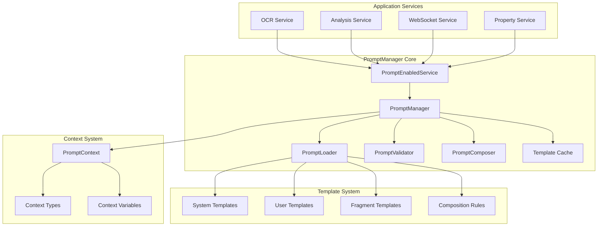

# Real2.AI Prompt Management System Overview

*Comprehensive guide to the Real2.AI PromptManager system and template architecture*  
*Version: 2.0 - Current Implementation*  
*Last Updated: August 2025*

## Executive Summary

Real2.AI implements a sophisticated prompt management system built around the `PromptManager` core that provides template-driven, context-aware prompt generation for Australian legal document analysis. The system supports multi-layered prompts, fragment composition, caching, and intelligent fallback mechanisms.

## Architecture Overview

### System Components



## Core Classes and Interfaces

### 1. PromptManager (`app/core/prompts/manager.py`)

**Primary Interface:**
```python
class PromptManager:
    """Central prompt management system with caching and composition"""
    
    async def render(
        self,
        template_name: str,
        context: Union[Dict[str, Any], PromptContext],
        cache_key: Optional[str] = None,
        version: Optional[str] = None
    ) -> str:
        """Render a single prompt template"""
        
    async def render_composed(
        self,
        composition_name: str,
        context: Union[Dict[str, Any], PromptContext],
        return_parts: bool = False
    ) -> Union[str, Dict[str, str]]:
        """Render system+user composed prompts"""
        
    async def execute_workflow(
        self,
        workflow_name: str,
        context: PromptContext,
        **kwargs
    ) -> Dict[str, Any]:
        """Execute multi-step prompt workflow"""
```

**Key Features:**
- Template loading and validation
- Context-aware rendering with Jinja2
- Intelligent caching with TTL
- Fragment composition and inheritance
- Performance monitoring and metrics
- Graceful error handling and fallbacks

### 2. PromptEnabledService (`app/core/prompts/service_mixin.py`)

**Service Integration Pattern:**
```python
class PromptEnabledService(ABC):
    """Base class for services using PromptManager"""
    
    def __init__(self):
        self.prompt_manager: PromptManager = get_prompt_manager()
        self._service_name = self.__class__.__name__.lower().replace('service', '')
    
    async def render_prompt(
        self,
        template_name: str,
        context: Union[Dict[str, Any], PromptContext],
        **kwargs
    ) -> str:
        """Render prompt with service-specific context"""
        
    async def render_composed(
        self,
        composition_name: str,
        context: Union[Dict[str, Any], PromptContext],
        **kwargs
    ) -> Dict[str, str]:
        """Render system+user composed prompts"""
        
    def create_context(self, **variables) -> PromptContext:
        """Create context with service defaults"""
```

**Integration Example:**
```python
class GeminiOCRService(PromptEnabledService):
    async def extract_text_from_image(
        self,
        image_data: bytes,
        australian_state: AustralianState,
        contract_type: ContractType
    ) -> Dict[str, Any]:
        # Create context
        context = self.create_context(
            australian_state=australian_state.value,
            contract_type=contract_type.value,
            quality_requirements="high"
        )
        
        # Get prompt from template
        prompt = await self.render_prompt(
            template_name="ocr_extraction",
            context=context
        )
        
        # Execute with generated prompt
        return await self.client.generate_content(prompt, image_data)
```

### 3. PromptContext (`app/core/prompts/context.py`)

**Context Management:**
```python
@dataclass
class PromptContext:
    """Rich context object for prompt rendering"""
    context_type: ContextType
    variables: Dict[str, Any]
    australian_state: Optional[AustralianState] = None
    contract_type: Optional[ContractType] = None
    user_type: Optional[str] = None
    complexity: Optional[ComplexityLevel] = None
    service_name: Optional[str] = None
    timestamp: datetime = field(default_factory=datetime.utcnow)
    
    def to_dict(self) -> Dict[str, Any]:
        """Convert to template variables"""
        
    def validate(self) -> List[str]:
        """Validate context completeness"""
```

**Context Types:**
- `SYSTEM` - System-level prompts (assistant behavior)
- `USER` - User-facing prompts (task instructions)
- `WORKFLOW` - Multi-step workflow prompts
- `FRAGMENT` - Reusable prompt fragments

## Template System

### 1. Template Structure

**File Organization:**
```
backend/app/prompts/
├── templates/
│   ├── system/                    # System prompts
│   │   ├── base/
│   │   │   └── assistant_core.md  # Core assistant behavior
│   │   ├── context/
│   │   │   └── australian_legal.md # Australian legal context
│   │   └── domain/
│   │       └── legal_specialist.md # Domain expertise
│   ├── user/                      # User instruction templates
│   │   ├── instructions/
│   │   │   ├── contract_analysis_base.md
│   │   │   ├── ocr_extraction_base.md
│   │   │   └── risk_assessment_base.md
│   │   └── templates/
│   │       └── outputs/
│   │           └── analysis_report.md
│   ├── ocr/                       # OCR-specific templates
│   │   ├── ocr_extraction.md
│   │   ├── general_document_extraction.md
│   │   └── whole_document_extraction.md
│   ├── analysis/                  # Contract analysis templates
│   │   ├── contract_structure.md
│   │   ├── risk_analysis_structured.md
│   │   ├── semantic_analysis.md
│   │   └── semantic_risk_consolidation.md
│   └── workflow/                  # Workflow templates
│       ├── contract_recommendations.md
│       └── contract_risk_assessment.md
├── fragments/                     # Reusable fragments
│   ├── common/                    # Cross-state fragments
│   │   ├── cooling_off_framework.md
│   │   ├── financial_risk_indicators.md
│   │   ├── statutory_warranties.md
│   │   └── unfair_terms_protection.md
│   ├── nsw/                       # NSW-specific fragments
│   │   ├── cooling_off_period.md
│   │   ├── ocr_terminology.md
│   │   ├── planning_certificates.md
│   │   └── risk_indicators.md
│   ├── vic/                       # VIC-specific fragments
│   │   ├── cooling_off_period.md
│   │   ├── ocr_terminology.md
│   │   ├── risk_indicators.md
│   │   └── vendor_statements.md
│   └── qld/                       # QLD-specific fragments
│       ├── body_corporate.md
│       ├── disclosure_statements.md
│       └── risk_indicators.md
├── config/                        # Configuration files
│   ├── composition_rules.yaml     # Template composition rules
│   ├── service_mappings.yaml      # Service-template mappings
│   └── version_manifest.yaml      # Version management
└── shared/                        # Shared resources
    └── fragments/
        └── legal_terms.md
```

### 2. Template Format

**YAML Frontmatter + Markdown Content:**
```markdown
---
# Template metadata
type: "user"
name: "ocr_extraction"
version: "1.2.0"
description: "Extract text from Australian property contracts"

# Template requirements
required_variables:
  - "australian_state"
  - "contract_type"
  - "document_type"
optional_variables:
  - "quality_requirements"
  - "user_experience_level"

# Model compatibility
model_compatibility: ["gpt-4", "gemini-2.5-flash"]
max_tokens: 4000
temperature: 0.1

# Fragment composition
includes:
  - "common/statutory_warranties"
  - "{{ australian_state|lower }}/ocr_terminology"

# Validation rules  
validation:
  min_length: 100
  required_sections: ["requirements", "output_format"]
---

# OCR Text Extraction - {{ australian_state }} {{ contract_type }}

You are an expert OCR system specializing in Australian {{ document_type }}s.
This document is from {{ australian_state }}, Australia.

## Extraction Requirements

1. **Accuracy**: Extract every word with 95%+ precision
2. **Structure**: Preserve formatting and layout
3. **Completeness**: Include all text including fine print
4. **Australian Context**: Focus on Australian legal terminology


### NSW Specific Requirements
{{ fragment("nsw/ocr_terminology") }}
{{ fragment("nsw/planning_certificates") }}

### VIC Specific Requirements  
{{ fragment("vic/ocr_terminology") }}
{{ fragment("vic/vendor_statements") }}

### QLD Specific Requirements
{{ fragment("qld/disclosure_statements") }}
{{ fragment("qld/body_corporate") }}



## Purchase Agreement Focus Areas
{{ fragment("purchase/ocr_focus_areas") }}
{{ fragment("purchase/finance_conditions") }}


## Quality Requirements

{{ fragment("ocr/high_quality_processing") }}


## Output Format
Return ONLY the extracted text maintaining document structure.
Use [UNCLEAR] for illegible text with best interpretation in brackets.

{{ fragment("common/statutory_warranties") }}
```

### 3. Fragment System

**Fragment Definition (`fragments/common/cooling_off_framework.md`):**
```markdown
---
type: "fragment"
name: "cooling_off_framework"
description: "Australian cooling-off period legal framework"
applies_to: ["all_states"]
---

## Cooling-Off Period Framework

Australian property purchases include mandatory cooling-off periods:

| State | Period | Type | Exclusions |
|-------|--------|------|------------|
| NSW   | 5 days | Business | Auction sales |
| VIC   | 3 days | Business | Auction sales |
| QLD   | 5 days | Calendar | Auction, contract race |
| SA    | 2 days | Clear    | Auction sales |
| WA    | 5 days | Business | Auction sales |
| TAS   | None   | N/A      | No statutory period |
| ACT   | 5 days | Business | Auction sales |

**Important**: Cooling-off periods are mandatory consumer protections.
Waiver requires independent legal advice and specific circumstances.
```

**Fragment Usage in Templates:**
```jinja2

{{ fragment("common/cooling_off_framework") }}



{{ fragment(australian_state|lower + "/cooling_off_period") }}

```

## Composition System

### 1. Composition Rules (`config/composition_rules.yaml`)

**Complete Analysis Composition:**
```yaml
compositions:
  complete_contract_analysis:
    name: "Complete Contract Analysis"
    description: "Full contract analysis pipeline"
    
    system_prompts:
      - template: "system/base/assistant_core"
        weight: 1.0
      - template: "system/context/australian_legal"
        weight: 1.0
        condition: "australian_state is defined"
      - template: "system/domain/legal_specialist"
        weight: 0.8
    
    workflow_steps:
      - step: "ocr_extraction"
        template: "ocr/ocr_extraction"
        required_context: ["australian_state", "contract_type"]
        output_variable: "extracted_text"
        max_tokens: 4000
        
      - step: "structure_analysis"
        template: "analysis/contract_structure"
        required_context: ["extracted_text"]
        depends_on: ["ocr_extraction"]
        output_variable: "structured_data"
        max_tokens: 6000
        
      - step: "risk_assessment"
        template: "analysis/risk_analysis_structured"
        required_context: ["structured_data", "australian_state"]
        depends_on: ["structure_analysis"]
        output_variable: "risk_analysis"
        max_tokens: 4000
        
      - step: "compliance_check"
        template: "workflow/contract_risk_assessment"
        required_context: ["structured_data", "australian_state"]
        depends_on: ["structure_analysis"]
        output_variable: "compliance_result"
        parallel_with: ["risk_assessment"]
        
      - step: "final_recommendations"
        template: "workflow/contract_recommendations"
        required_context: ["structured_data", "risk_analysis", "compliance_result"]
        depends_on: ["risk_assessment", "compliance_check"]
        output_variable: "recommendations"
        max_tokens: 3000

  ocr_to_analysis:
    name: "OCR to Analysis Pipeline"
    description: "Streamlined OCR and basic analysis"
    
    system_prompts:
      - template: "system/base/assistant_core"
        weight: 1.0
        
    workflow_steps:
      - step: "enhanced_ocr"
        template: "ocr/general_document_extraction"
        required_context: ["australian_state", "document_type"]
        output_variable: "extracted_content"
        
      - step: "semantic_analysis"
        template: "analysis/semantic_analysis"
        required_context: ["extracted_content"]
        depends_on: ["enhanced_ocr"]
        output_variable: "semantic_result"
```

### 2. Service Mappings (`config/service_mappings.yaml`)

**Service-Template Associations:**
```yaml
service_mappings:
  gemini_ocr_service:
    primary_templates:
      - "ocr/ocr_extraction"
      - "ocr/general_document_extraction"
      - "ocr/whole_document_extraction"
    
    default_composition: "ocr_to_analysis"
    
    context_defaults:
      quality_requirements: "high"
      use_enhanced_prompts: true
    
    fallback_templates:
      - "ocr/basic_extraction"  # Legacy fallback
      
  contract_analysis_service:
    primary_templates:
      - "analysis/contract_structure"
      - "analysis/risk_analysis_structured"
      - "analysis/semantic_risk_consolidation"
      
    default_composition: "complete_contract_analysis"
    
    context_defaults:
      analysis_depth: "comprehensive"
      include_recommendations: true
    
  websocket_service:
    primary_templates:
      - "notifications/progress_updates"
      - "notifications/error_messages"
      - "notifications/completion_summary"
    
    context_defaults:
      user_facing: true
      tone: "professional"

  property_profile_service:
    primary_templates:
      - "property/property_analysis"
      - "property/market_insights"
    
    context_defaults:
      include_market_data: true
      analysis_scope: "comprehensive"
```

## Caching and Performance

### 1. Template Caching

**Multi-Level Caching Strategy:**
```python
class PromptCache:
    """Intelligent caching for templates and rendered prompts"""
    
    def __init__(self):
        # In-memory template cache
        self._template_cache: Dict[str, TemplateInfo] = {}
        self._template_cache_ttl: Dict[str, datetime] = {}
        
        # Rendered prompt cache with LRU eviction
        self._render_cache = LRUCache(maxsize=1000)
        
        # Fragment cache for composition
        self._fragment_cache: Dict[str, str] = {}
        
    async def get_template(
        self,
        template_name: str,
        version: Optional[str] = None
    ) -> Optional[Template]:
        """Get template with caching"""
        
    async def cache_rendered_prompt(
        self,
        cache_key: str,
        rendered_prompt: str,
        ttl: int = 3600
    ) -> None:
        """Cache rendered prompt result"""
        
    def get_cache_stats(self) -> Dict[str, Any]:
        """Get comprehensive cache statistics"""
        return {
            "template_cache_size": len(self._template_cache),
            "render_cache_hit_rate": self._render_cache.hit_rate,
            "fragment_cache_size": len(self._fragment_cache),
            "memory_usage_mb": self._estimate_memory_usage()
        }
```

**Performance Optimizations:**
- Template pre-loading on startup
- Jinja2 template compilation caching
- Fragment composition result caching
- Context variable optimization
- Batch rendering for multiple templates

### 2. Performance Monitoring

**Built-in Metrics:**
```python
@dataclass
class PromptPerformanceMetrics:
    template_name: str
    service_name: str
    render_time_ms: float
    token_count: int
    cache_hit: bool
    success: bool
    context_variables: int
    fragment_count: int
    timestamp: datetime
```

**Monitoring Dashboard Data:**
```json
{
  "overall_stats": {
    "total_renders": 15420,
    "average_render_time": 42.3,
    "cache_hit_rate": 0.847,
    "success_rate": 0.994
  },
  "template_performance": {
    "ocr_extraction": {
      "renders": 3847,
      "avg_time": 38.2,
      "cache_hits": 0.891,
      "success_rate": 0.998
    },
    "risk_analysis_structured": {
      "renders": 2934,
      "avg_time": 67.1,
      "cache_hits": 0.723,
      "success_rate": 0.987
    }
  },
  "service_usage": {
    "gemini_ocr_service": 5842,
    "contract_analysis_service": 4521,
    "websocket_service": 3289
  }
}
```

## Error Handling and Fallbacks

### 1. Graceful Degradation

**Fallback Hierarchy:**
1. **Template Not Found**: Use fallback templates from service mapping
2. **Rendering Error**: Retry with simplified context
3. **Fragment Missing**: Skip fragment or use generic replacement
4. **Context Validation Failed**: Use default values or prompt user
5. **Complete Failure**: Fall back to legacy hardcoded prompts

**Implementation:**
```python
class PromptManager:
    async def render(self, template_name: str, context: PromptContext) -> str:
        try:
            # Primary rendering attempt
            return await self._render_with_validation(template_name, context)
        except TemplateNotFoundError:
            # Try fallback template
            fallback = self._get_fallback_template(template_name)
            if fallback:
                return await self._render_with_validation(fallback, context)
            raise
        except ContextValidationError as e:
            # Retry with minimal context
            minimal_context = self._create_minimal_context(context)
            logger.warning(f"Context validation failed, using minimal: {e}")
            return await self._render_with_validation(template_name, minimal_context)
        except Exception as e:
            # Log and re-raise for service-level handling
            logger.error(f"Prompt rendering failed: {template_name}, {e}")
            raise PromptRenderingError(f"Failed to render {template_name}") from e
```

### 2. Validation and Quality Checks

**Template Validation:**
```python
class PromptValidator:
    """Comprehensive template validation"""
    
    def validate_template(self, template: Template) -> ValidationResult:
        errors = []
        warnings = []
        
        # Syntax validation
        if not self._validate_jinja_syntax(template.content):
            errors.append("Invalid Jinja2 syntax")
            
        # Required variables check
        template_vars = self._extract_template_variables(template.content)
        missing_vars = set(template.required_variables) - template_vars
        if missing_vars:
            errors.append(f"Missing required variables: {missing_vars}")
            
        # Fragment reference validation
        fragment_refs = self._extract_fragment_references(template.content)
        for ref in fragment_refs:
            if not self._fragment_exists(ref):
                warnings.append(f"Fragment not found: {ref}")
                
        # Model compatibility check
        if template.max_tokens and template.max_tokens > self._get_model_limit(template.model_compatibility[0]):
            warnings.append(f"Token count may exceed model limit")
            
        return ValidationResult(errors=errors, warnings=warnings)
```

## Australian Legal Specialization

### 1. State-Specific Templates

**NSW Specific Example (`fragments/nsw/cooling_off_period.md`):**
```markdown
---
type: "fragment"
name: "nsw_cooling_off_period"
description: "NSW cooling-off period requirements"
jurisdiction: "NSW"
---

## NSW Cooling-Off Period Requirements

### Standard Residential Property
- **Period**: 5 business days from exchange
- **Calculation**: Excludes Saturdays, Sundays, and public holidays
- **Waiver**: Requires independent legal advice certificate

### Key NSW-Specific Rules
1. **Section 66W Conveyancing Act 1919**
2. **Home Building Act disclosure requirements**
3. **Property Sales Act consumer protections**

### Exemptions
- Auction sales (no cooling-off period)
- Industrial or commercial property over $1M
- Property purchased as investment via company/trust (conditions apply)
```

### 2. Contract Type Specialization

**Purchase Agreement Template (`user/analysis/contract_structure.md`):**
```markdown
---
type: "user"
name: "contract_structure_analysis"
description: "Analyze Australian property purchase agreement structure"
---

# Contract Structure Analysis - {{ australian_state }} Purchase Agreement

Analyze the structure and key terms of this {{ australian_state }} property purchase agreement.

## Required Analysis Sections

### 1. Parties and Property
- Vendor and purchaser identification
- Property address and legal description
- Title details and encumbrances

### 2. Financial Terms
- Purchase price and GST treatment
- Deposit amount and payment terms
- Balance and settlement arrangements

### 3. Settlement Details
{{ fragment("common/settlement_requirements") }}

{{ fragment("nsw/settlement_procedures") }}


### 4. Special Conditions Analysis
{{ fragment("purchase/special_conditions_framework") }}

### 5. Australian Legal Compliance
{{ fragment("common/statutory_warranties") }}
{{ fragment(australian_state|lower + "/disclosure_requirements") }}

## Output Format
Provide structured JSON with confidence scores for each extracted term.
```

## Integration Examples

### 1. OCR Service Integration

```python
class GeminiOCRService(PromptEnabledService):
    async def extract_text_with_context(
        self,
        image_data: bytes,
        australian_state: AustralianState,
        contract_type: ContractType,
        quality_level: str = "high"
    ) -> OCRResult:
        # Create rich context
        context = self.create_context(
            australian_state=australian_state.value,
            contract_type=contract_type.value,
            document_type="purchase_agreement",
            quality_requirements=quality_level,
            extraction_focus="legal_terms",
            user_experience_level="professional"
        )
        
        # Get enhanced OCR prompt
        prompt = await self.render_prompt(
            template_name="ocr_extraction",
            context=context
        )
        
        # Execute OCR with enhanced prompt
        result = await self.gemini_client.generate_content(
            prompt=prompt,
            image_data=image_data
        )
        
        return OCRResult(
            extracted_text=result.text,
            confidence=result.confidence,
            template_used="ocr_extraction",
            context_variables=context.to_dict(),
            enhancement_applied=True
        )
```

### 2. Analysis Service Integration

```python
class ContractAnalysisService(PromptEnabledService):
    async def analyze_contract_comprehensive(
        self,
        extracted_text: str,
        context: AnalysisContext
    ) -> ContractAnalysisResult:
        # Execute composition workflow
        composition_result = await self.prompt_manager.execute_workflow(
            workflow_name="complete_contract_analysis",
            context=self.create_context(
                extracted_text=extracted_text,
                australian_state=context.australian_state.value,
                contract_type=context.contract_type.value,
                analysis_depth="comprehensive",
                include_risk_assessment=True,
                include_compliance_check=True
            )
        )
        
        return ContractAnalysisResult(
            contract_terms=composition_result["structured_data"],
            risk_assessment=composition_result["risk_analysis"],
            compliance_check=composition_result["compliance_result"],
            recommendations=composition_result["recommendations"],
            workflow_metadata=composition_result["metadata"]
        )
```

## Development and Testing

### 1. Template Development Workflow

```bash
# Template development cycle
cd backend/app/prompts

# 1. Create new template
cp user/template_example.md user/analysis/new_analysis.md

# 2. Edit template with proper frontmatter
# Add required_variables, model_compatibility, etc.

# 3. Validate template
python -m app.core.prompts.validator validate user/analysis/new_analysis.md

# 4. Test rendering
python -m app.core.prompts.test_template user/analysis/new_analysis.md \
  --context '{"australian_state": "NSW", "contract_type": "purchase_agreement"}'

# 5. Update service mappings
vim config/service_mappings.yaml

# 6. Test integration
python -m pytest tests/test_prompt_integration.py::test_new_analysis_template
```

### 2. Testing Strategy

**Unit Tests:**
```python
class TestPromptManager(unittest.TestCase):
    def setUp(self):
        self.prompt_manager = PromptManager()
        self.test_context = PromptContext(
            context_type=ContextType.USER,
            variables={
                "australian_state": "NSW",
                "contract_type": "purchase_agreement"
            }
        )
    
    async def test_template_rendering(self):
        result = await self.prompt_manager.render(
            template_name="ocr_extraction",
            context=self.test_context
        )
        
        self.assertIsInstance(result, str)
        self.assertIn("NSW", result)
        self.assertIn("purchase agreement", result.lower())
        
    async def test_composition_workflow(self):
        result = await self.prompt_manager.execute_workflow(
            workflow_name="complete_contract_analysis",
            context=self.test_context
        )
        
        self.assertIn("structured_data", result)
        self.assertIn("risk_analysis", result)
```

**Integration Tests:**
```python
class TestServiceIntegration(unittest.TestCase):
    async def test_ocr_service_prompt_integration(self):
        service = GeminiOCRService()
        
        with open("test_data/sample_contract.pdf", "rb") as f:
            result = await service.extract_text_with_context(
                image_data=f.read(),
                australian_state=AustralianState.NSW,
                contract_type=ContractType.PURCHASE_AGREEMENT
            )
        
        self.assertTrue(result.enhancement_applied)
        self.assertEqual(result.template_used, "ocr_extraction")
        self.assertGreater(result.confidence, 0.9)
```

## Monitoring and Analytics

### 1. Performance Dashboards

**Template Usage Analytics:**
- Most frequently used templates
- Average rendering times by template
- Cache hit rates and efficiency
- Error rates and common failures
- Service adoption of enhanced prompts

### 2. Quality Metrics

**Content Quality Tracking:**
- Template effectiveness scores
- User satisfaction with prompt outputs
- A/B testing results for template variations
- Accuracy improvements over baseline prompts

---

The Real2.AI Prompt Management System provides a comprehensive, scalable foundation for AI-powered Australian legal document analysis, combining sophisticated template composition, intelligent caching, and robust error handling to deliver consistent, high-quality prompts across all system services.