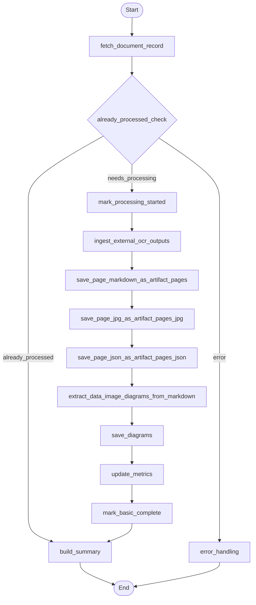

#o## External OCR Document Processing Workflow PRD

#### Objective

Replace paragraph-centric processing with an external OCR ingestion workflow that consumes pre-produced per-page artifacts (Markdown, JPG, JSON) and persists them as shared artifacts. Extract embedded `data:image/*;base64,...` images from the Markdown to populate `artifact_diagrams`. Remove usage of `artifact_paragraphs` throughout the pipeline.

#### Background and Motivation

- Current subflow `backend/app/agents/subflows/document_processing_workflow.py` segments paragraphs and writes to `artifact_paragraphs`. We are sunsetting paragraphs.
- External OCR service now produces one Markdown, one JPG, and one JSON file per page. Example directory: `backend/app/agents/subflows/layout_results_58ee18a7` containing files like:
  - `demo_58ee18a7_page_0.md` / `demo_58ee18a7_page_0_nohf.md`
  - `demo_58ee18a7_page_0.jpg`
  - `demo_58ee18a7_page_0.json`
- We will treat:
  - Markdown as source for `artifact_pages` (store the Markdown as the page text blob)
  - JPGs as `artifact_pages_jpg`
  - JSON as `artifact_pages_json`
  - Images embedded in Markdown (`data:image/...;base64,....`) as `artifact_diagrams`

This aligns storage with immutable shared artifacts and per-user page rows, while eliminating paragraph tables and nodes.

#### Scope

- In-scope
  - New nodes to ingest external OCR outputs, persist artifacts, and extract/save diagrams.
  - Schema addition for `artifact_pages_jpg` and `artifact_pages_json`.
  - Removal of `artifact_paragraphs` usage from code and flow; optional DB deprecation or drop.
  - Idempotent content-addressed writes keyed by `(content_hmac, algorithm_version, params_fingerprint, page_number)`.
- Out-of-scope
  - Any LLM-based paragraph segmentation and paragraph UX/API.
  - Non-OCR analysis steps beyond diagram extraction.

#### High-Level Design



#### Artifact Mapping and Storage Rules

- Common columns for artifacts: `content_hmac`, `algorithm_version`, `params_fingerprint`, `page_number`.
- `artifact_pages`
  - `page_text_uri` stores the Markdown blob (not plain text transcription). Compute `page_text_sha256` from the Markdown bytes.
  - `layout`/`metrics` can carry lightweight page-level metadata (e.g., word count, extraction method if available).
- `artifact_pages_jpg` (new)
  - Stores URIs and hashes for per-page rendered JPGs produced by external OCR.
  - Unique on `(content_hmac, algorithm_version, params_fingerprint, page_number)`.
- `artifact_pages_json` (new)
  - Stores URIs and hashes for per-page JSON layout data (e.g., blocks, spans) from external OCR.
  - Unique on `(content_hmac, algorithm_version, params_fingerprint, page_number)`.
- `artifact_diagrams`
  - Extract images embedded in Markdown: `data:image/<type>;base64,<payload>`.
  - Compute sha256 of decoded bytes, use that as `diagram_key` (e.g., `img::<sha256>`), set `page_number` and minimal `diagram_meta` including `mime_type`, `byte_length`, `found_in` (file name), optional `index_in_page_markdown`.

#### Data Contracts

- External OCR output directory contract:
  - Allowed markdown file variants per page: `<prefix>_page_<n>.md` and/or `<prefix>_page_<n>_nohf.md`.
    - Config `USE_NOHF_VARIANT` chooses `_nohf.md` when available for cleaner text.
  - JPG: `<prefix>_page_<n>.jpg`.
  - JSON: `<prefix>_page_<n>.json`.

- Algorithm versioning and params:
  - `algorithm_version`: integer identifying the external OCR pipeline version.
  - `params_fingerprint`: stable fingerprint of external OCR params/settings.
  - `content_hmac`: computed from original document bytes (existing), propagated in state.

#### Schema Changes (DDL)

New shared artifact tables (service-role only):

```sql
-- artifact_pages_jpg: per-page raster image artifact
CREATE TABLE IF NOT EXISTS artifact_pages_jpg (
  id uuid PRIMARY KEY DEFAULT gen_random_uuid(),
  content_hmac text NOT NULL,
  algorithm_version int NOT NULL,
  params_fingerprint text NOT NULL,
  page_number int NOT NULL,
  page_image_uri text NOT NULL,
  page_image_sha256 text NOT NULL,
  metadata jsonb,
  created_at timestamptz DEFAULT now(),
  UNIQUE (content_hmac, algorithm_version, params_fingerprint, page_number)
);

CREATE INDEX IF NOT EXISTS idx_artifact_pages_jpg_lookup
  ON artifact_pages_jpg (content_hmac, algorithm_version, params_fingerprint);

-- artifact_pages_json: per-page structured layout artifact
CREATE TABLE IF NOT EXISTS artifact_pages_json (
  id uuid PRIMARY KEY DEFAULT gen_random_uuid(),
  content_hmac text NOT NULL,
  algorithm_version int NOT NULL,
  params_fingerprint text NOT NULL,
  page_number int NOT NULL,
  page_json_uri text NOT NULL,
  page_json_sha256 text NOT NULL,
  stats jsonb,
  created_at timestamptz DEFAULT now(),
  UNIQUE (content_hmac, algorithm_version, params_fingerprint, page_number)
);

CREATE INDEX IF NOT EXISTS idx_artifact_pages_json_lookup
  ON artifact_pages_json (content_hmac, algorithm_version, params_fingerprint);
```

RLS policies should mirror `artifact_pages`/`artifact_diagrams` (service-role only). Grant/revokes aligned accordingly.

Paragraphs removal:

```sql
-- If safe to drop:
DROP TABLE IF EXISTS artifact_paragraphs;
DROP TABLE IF EXISTS user_document_paragraphs;

-- If deprecating first, keep but stop writing to it and mark as unused.
```

#### Subflow Changes (LangGraph)

- Remove nodes and edges related to paragraphs:
  - `ParagraphSegmentationNode`
  - `SaveParagraphsNode`
  - Edges from `extract_text -> paragraph_segmentation -> save_paragraphs`

- Add new nodes:
  - `IngestExternalOCROutputsNode` (reads directory listing / service results, normalizes file set per page)
  - `SavePageMarkdownAsArtifactPagesNode` (stores `.md` as `artifact_pages`)
  - `SavePageJPGAsArtifactPagesJPGNode` (stores `.jpg` into `artifact_pages_jpg`)
  - `SavePageJSONAsArtifactPagesJSONNode` (stores `.json` into `artifact_pages_json`)
  - `ExtractDataImageDiagramsFromMarkdownNode` (parses Markdown; yields diagrams)
  - Reuse existing `SaveDiagramsNode` or introduce `SaveExtractedDiagramsNode` to persist into `artifact_diagrams`

#### Node Contracts

- `IngestExternalOCROutputsNode`
  - Inputs: `document_id`, `state.storage_path` or `external_ocr_dir`, `content_hmac`, `algorithm_version`, `params_fingerprint`, `USE_NOHF_VARIANT`.
  - Output in state:
    - `ocr_pages`: list of `{ page_number, md_path, jpg_path, json_path, chosen_md_variant }`.

- `SavePageMarkdownAsArtifactPagesNode`
  - For each page in `ocr_pages`, read markdown bytes and upload via `ArtifactStorageService.upload_page_text` (URI + SHA256).
  - Insert into `artifact_pages` with layout/metrics set from minimal derived metrics (e.g., `text_length`, `extraction_method: "external_ocr"`).

- `SavePageJPGAsArtifactPagesJPGNode`
  - For each page, upload JPG via storage service (URI + SHA256) and insert into `artifact_pages_jpg`.

- `SavePageJSONAsArtifactPagesJSONNode`
  - For each page, upload JSON via storage service (URI + SHA256) and insert into `artifact_pages_json`.

- `ExtractDataImageDiagramsFromMarkdownNode`
  - For each page markdown, search for embedded images.
  - Regex: `!\\[[^\]]*\]\((data:image\/[^;\)]+;base64,[^)]+)\)`; also fallback plain search for `data:image/`.
  - For each `data:image/...;base64,<payload>`:
    - Decode base64 to bytes, compute sha256, mime_type from header.
    - Upload image bytes via storage service as `diagrams/<content_hmac>/p<page>/<sha256>.<ext>` returning URI + SHA256.
    - Build diagram record: `diagram_key = sha256`, `diagram_meta = { mime_type, byte_length, source: "markdown_embedded", page_markdown_file, index_in_file }`.
  - Outputs: `diagram_candidates` list for persistence.

- `SaveDiagramsNode` (existing)
  - Adjust to accept `diagram_candidates` and upsert by `(content_hmac, algorithm_version, params_fingerprint, page_number, diagram_key)`.

All nodes follow the repository pattern for DB writes and the storage service for blobs, consistent with project conventions.

#### Repositories and Services

- `ArtifactsRepository`
  - Add methods:
    - `insert_page_jpg_artifact(content_hmac, algorithm_version, params_fingerprint, page_number, page_image_uri, page_image_sha256, metadata)`
    - `insert_page_json_artifact(content_hmac, algorithm_version, params_fingerprint, page_number, page_json_uri, page_json_sha256, stats)`
    - `get_page_jpg_artifacts_by_hmac_and_version(...)` / `get_page_json_artifacts_by_hmac_and_version(...)` for idempotency checks
  - Reuse existing `insert_page_artifact(...)` for markdown-backed `artifact_pages`.

- `ArtifactStorageService`
  - Add helpers:
    - `upload_page_markdown(markdown_bytes, content_hmac, page_number)` (or reuse `upload_page_text` if already generic)
    - `upload_page_image_jpg(image_bytes, content_hmac, page_number)`
    - `upload_page_json(json_bytes, content_hmac, page_number)`
    - `upload_diagram_image(image_bytes, content_hmac, page_number, sha256, ext)`

#### State Extensions

- Remove `paragraphs`, `paragraph_artifacts` from `DocumentProcessingState`.
- Add:
  - `ocr_pages: List[OcrPage]`
  - `diagram_candidates: List[DiagramCandidate]`

#### Idempotency

- Before inserts, query by `(content_hmac, algorithm_version, params_fingerprint, page_number)` and skip existing rows.
- For diagrams, upsert by `(content_hmac, algorithm_version, params_fingerprint, page_number, diagram_key)` where `diagram_key = sha256(image_bytes)`.

#### Error Handling

- Missing file variants: log and continue per page; only fail if all page artifacts for document are missing.
- Malformed base64 images: skip that instance and continue extracting others.

#### Implementation Plan

1) Schema
   - Create a new migration file under `supabase/migrations/` introducing `artifact_pages_jpg` and `artifact_pages_json` and policies mirroring `artifact_pages`.
   - Optionally drop `artifact_paragraphs` and `user_document_paragraphs` after a deprecation window.

2) Repositories
   - Extend `backend/app/services/repositories/artifacts_repository.py` with insert/get helpers for the new tables.
   - Ensure all repository writes are service-role scoped as with existing artifact tables.

3) Storage Service
   - Extend `backend/app/services/storage/artifact_storage_service.py` (or equivalent) with upload helpers for md/jpg/json and diagrams.

4) Nodes (under `backend/app/agents/nodes/document_processing_subflow/`)
   - `ingest_external_ocr_outputs_node.py`
   - `save_page_markdown_node.py`
   - `save_page_jpg_node.py`
   - `save_page_json_node.py`
   - `extract_markdown_diagrams_node.py`
   - Reuse or add `save_diagrams_node.py` if needed for the new candidate format.

5) Subflow Wiring
   - Edit `backend/app/agents/subflows/document_processing_workflow.py`:
     - Remove `paragraph_segmentation` and `save_paragraphs` nodes and edges.
     - Add new nodes and edges per the Mermaid diagram.
     - Ensure `check_extraction_success` branches to `ingest_external_ocr_outputs` instead of paragraph path (or, if text extraction is bypassed fully, go directly from `mark_processing_started` to `ingest_external_ocr_outputs`).

6) Diagram Extraction Details
   - Markdown scan per page:
     - Primary regex: `!\\[[^\]]*\]\((data:image\/[^;\)]+;base64,[^)]+)\)`
     - Fallback: locate all substrings matching `data:image/[^;]+;base64,([A-Za-z0-9+/=]+)`
   - For each match:
     - Parse media type, decode base64 to bytes; compute sha256; determine extension by MIME (e.g., `image/png` -> `.png`, `image/jpeg` -> `.jpg`).
     - Upload and insert into `artifact_diagrams` via repository.

7) Tests
   - Unit: repositories for new tables; diagram extractor (regex coverage incl. edge cases); nodes happy-path/partial-failure.
   - Integration: end-to-end subflow run pointing to a fixture directory structured like `layout_results_58ee18a7`.
   - Ensure no writes to paragraph tables and no references remain.

8) Backward Compatibility and Cleanup
   - Remove paragraph related code paths, feature flags, and docs.
   - Update API docs and UI components that previously relied on paragraph ids.

#### Acceptance Criteria

- Given a directory of external OCR outputs, the workflow stores:
  - One `artifact_pages` row per page with the Markdown blob URI/hash
  - One `artifact_pages_jpg` row per page with the JPG URI/hash
  - One `artifact_pages_json` row per page with the JSON URI/hash
  - Zero rows in paragraph tables
  - Diagram rows in `artifact_diagrams` for each embedded `data:image` found in page Markdown
- Workflow completes idempotently on re-run and does not duplicate artifacts.
- Observability: per-node traces include `document_id`, `content_hmac`, `page_counts`, and `diagram_counts`.

#### Security and RLS

- `artifact_pages`, `artifact_pages_jpg`, `artifact_pages_json`, `artifact_diagrams` remain shared artifact tables with service-role only policies.
- Per-user page linkage continues via `user_document_pages` referencing `artifact_pages.id` (unchanged).

#### Open Questions / Decisions

- Prefer `_nohf.md` variant by default? Default: yes (configurable) to reduce noise.
- Should JSON be normalized before upload? Default: upload raw JSON file; minimal stats extracted as `stats`.

#### Timeline (Indicative)

- Day 1-2: Migration + repository/service methods
- Day 3: Nodes + wiring
- Day 4: Diagram extraction + tests
- Day 5: Cleanup paragraphs + docs + end-to-end validation


