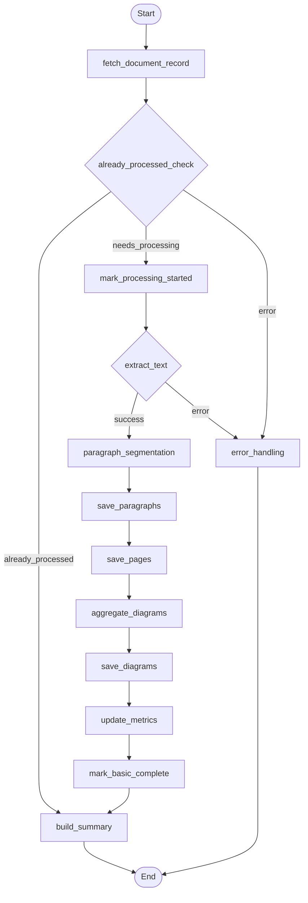

## Document Processing Workflow (LangGraph)

This diagram reflects the control flow defined in `backend/app/agents/subflows/document_processing_workflow.py`.

### Node Key
- **fetch_document_record**: Fetch metadata and validate access
- **already_processed_check**: Short-circuit if already processed
- **mark_processing_started**: Persist processing start state
- **extract_text**: Perform OCR/LLM/native text extraction
- **paragraph_segmentation**: Segment text into paragraphs and artifacts
- **save_paragraphs**: Persist paragraph references
- **save_pages**: Persist page-level analysis results
- **aggregate_diagrams**: Aggregate diagram detections
- **save_diagrams**: Persist diagram results
- **update_metrics**: Update aggregated metrics on the document
- **mark_basic_complete**: Mark processing status as complete
- **build_summary**: Construct final `ProcessedDocumentSummary`
- **error_handling**: Capture error details and finalize

