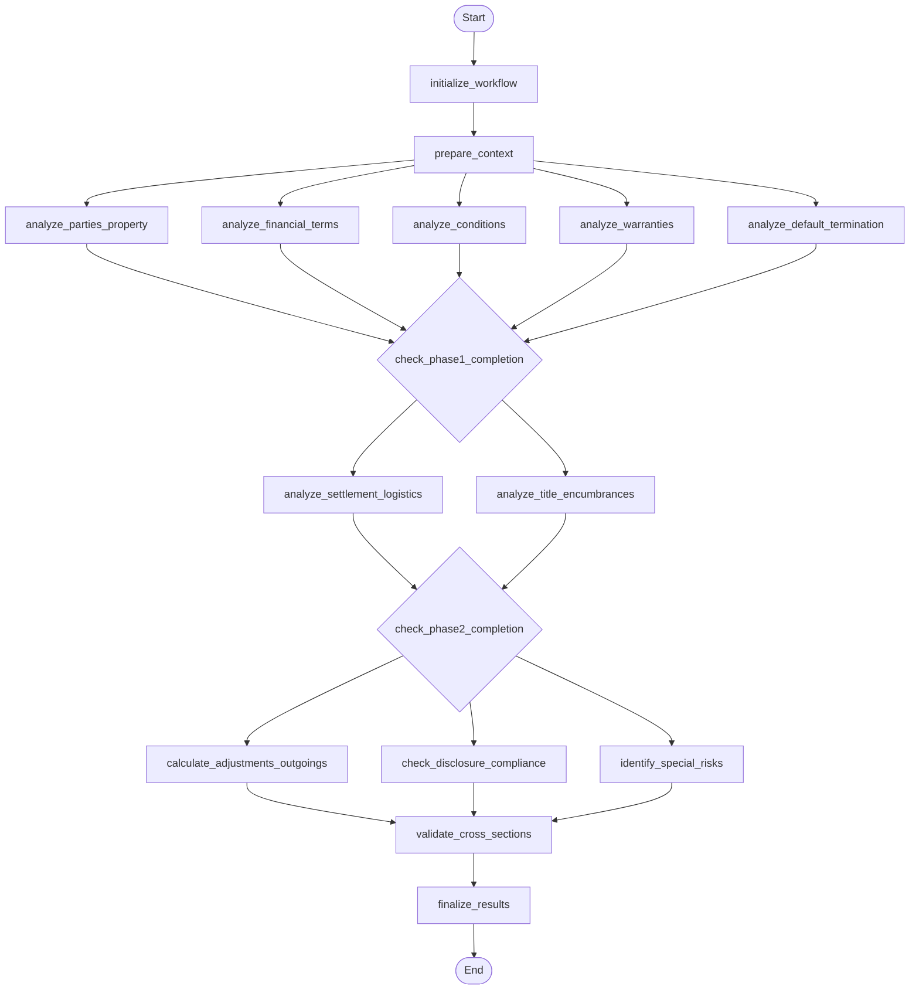

## Step 2 Section Analysis Workflow (LangGraph)

This diagram reflects the control flow defined in `backend/app/agents/subflows/step2_section_analysis_workflow.py`.

### Phases
- **Foundation Analysis (parallel)**: Parties/Property, Financial Terms, Conditions, Warranties, Default & Termination
- **Dependent Analysis (sequential)**: Settlement Logistics, Title & Encumbrances
- **Synthesis Analysis (sequential)**: Adjustments & Outgoings, Disclosure Compliance, Special Risks → Cross-section Validation → Finalization

### Node Key
- **initialize_workflow**: Validate inputs, set `start_time`, and emit initial progress; records missing `contract_text` or `entities_extraction` into `processing_errors`.
- **prepare_context**: Hoists `section_seeds` and `retrieval_index_id` from Step 1 `entities_extraction`; derives `legal_requirements_matrix` from contract metadata when not provided (via `derive_legal_requirements`).
- **analyze_parties_property**: Analyze parties and property description; writes `parties_property_result`.
- **analyze_financial_terms**: Analyze price, deposit, payment schedule; writes `financial_terms_result`.
- **analyze_conditions**: Analyze preconditions/conditions precedent (e.g., finance, inspections); writes `conditions_result`.
- **analyze_warranties**: Analyze vendor/buyer warranties; writes `warranties_result`.
- **analyze_default_termination**: Analyze events of default and termination rights; writes `default_termination_result`.
- **check_phase1_completion**: Confirms all Foundation results are present; marks `phase1_complete` and timestamps completion.
- **analyze_settlement_logistics**: Analyze settlement timing, deliverables, and logistics; writes `settlement_logistics_result`.
- **analyze_title_encumbrances**: Analyze title, encumbrances, and related diagrams/artifacts when provided; writes `title_encumbrances_result`.
- **check_phase2_completion**: Confirms Settlement and Title analyses completed.
- **calculate_adjustments_outgoings**: Compute adjustments and outgoings; writes `adjustments_outgoings_result`.
- **check_disclosure_compliance**: Check statutory/contractual disclosure obligations; writes `disclosure_compliance_result`.
- **identify_special_risks**: Surface special risks and unusual clauses; writes `special_risks_result`.
- **validate_cross_sections**: Cross-validate outputs to detect inconsistencies; writes `cross_section_validation_result`.
- **finalize_results**: Structure final response with `section_results`, `cross_section_validation`, and `workflow_metadata` (phase statuses, completion times, errors, risk flags, diagram metrics).

### Outputs
- **section_results**: Results per section (parties_property, financial_terms, conditions, warranties, default_termination, settlement_logistics, title_encumbrances, adjustments_outgoings, disclosure_compliance, special_risks)
- **cross_section_validation**: Cross-check summary and issues
- **workflow_metadata**: `{ phases_completed, phase_completion_times, processing_errors, skipped_analyzers, total_risk_flags, diagrams_processed, diagram_success_rate }`

