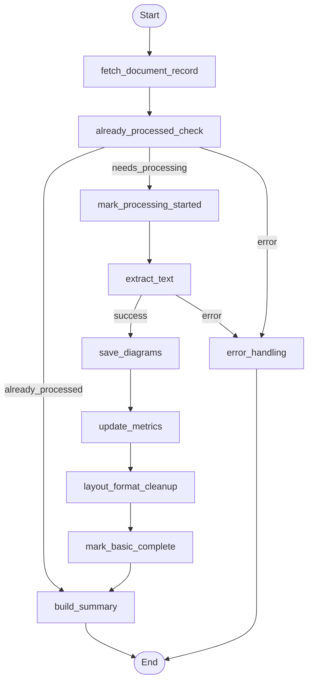

## Document Processing Workflow (LangGraph)

This diagram reflects the control flow defined in `backend/app/agents/subflows/document_processing_workflow.py`.

### Node Key
- **fetch_document_record**: Fetch metadata and validate access.
- **already_processed_check**: Short-circuit if results exist; else proceed or route to error.
- **mark_processing_started**: Mark job started and set initial status/progress.
- **extract_text**: Perform LLM/native OCR and text extraction.
- **save_diagrams**: Persist diagram detection results (aggregated per document).
- **update_metrics**: Update document metrics after extraction and diagram save.
- **layout_format_cleanup**: Clean and normalize layout/formatting without LLM.
- **mark_basic_complete**: Mark processing as complete for the basic pipeline.
- **build_summary**: Construct `ProcessedDocumentSummary`.
- **error_handling**: Handle errors and produce `ProcessingErrorResponse`.

### Progress Ranges (from code)
- fetch_document_record: 0–5
- already_processed_check: 5–7
- mark_processing_started: 7–8
- extract_text: 7–34
- save_diagrams: 34–40
- update_metrics: 40–41
- layout_format_cleanup: 41–48
- mark_basic_complete: 48–49
- build_summary: 49–50

