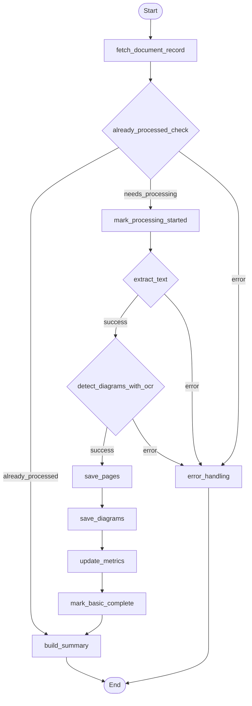

## Document Processing Workflow (LangGraph)

This diagram reflects the control flow defined in `backend/app/agents/subflows/document_processing_workflow.py`.

### Node Key
- **fetch_document_record**: Fetch metadata and validate access
- **already_processed_check**: Short-circuit if already processed
- **mark_processing_started**: Persist processing start state
- **extract_text**: Hybrid MuPDF + selective OCR (Gemini/Tesseract) with per-page analysis; computes `content_hmac`/`algorithm_version`/`params_fingerprint` and stores full-text + per-page text artifacts when enabled
- **detect_diagrams_with_ocr**: Use Gemini OCR per-page to detect/classify diagrams; renders page JPGs on the fly and may persist them as `artifact_type="image_jpg"` if artifact metadata is available
- **save_pages**: Map stored page artifacts to user document pages (idempotent upserts); does not store JPGs
- **save_diagrams**: Persist OCR-detected diagrams as artifacts with deterministic keys and map them to user document diagrams
- **update_metrics**: Update aggregated metrics on the document
- **mark_basic_complete**: Mark processing status as complete
- **build_summary**: Construct final `ProcessedDocumentSummary`
- **error_handling**: Capture error details and finalize

### Workflow Changes
This workflow has been updated to use the new schema design without paragraphs:
- **Removed**: `paragraph_segmentation`, `save_paragraphs`, `aggregate_diagrams` nodes
- **Added**: `detect_diagrams_with_ocr` node that uses Gemini OCR with a diagram-only prompt, respecting `max_diagram_pages` and retries/backoff from config
- **Modified**: `extract_text` performs hybrid extraction (PyMuPDF first, then selective OCR via Gemini or Tesseract) and stores full-text + per-page text artifacts in the artifact system
- **Modified**: `save_pages` maps existing page artifacts to user document pages; JPGs (when persisted) are handled during diagram detection, not here

