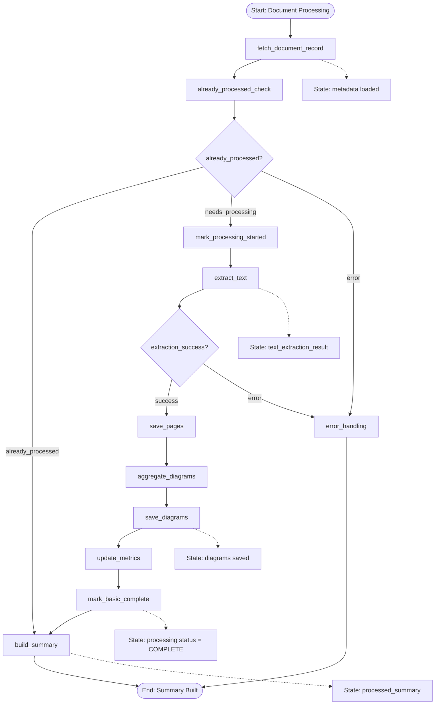

# LangGraph Document Processing Workflow

## Overview

This document visualizes the dedicated LangGraph subflow for document processing. It aligns with the structure and conventions used in the contract analysis workflow documentation, focusing on the core processing nodes, conditional routing, and terminal outcomes.

---

## Workflow Diagram

---

## Notes

- The flow is user-aware and maintains authentication context throughout all nodes.
- Conditional routing mirrors `check_already_processed` and `check_extraction_success` decisions.
- Terminal states converge at `build_summary` (success) or `error_handling` (failure).

