# LangGraph Contract Analysis Workflow - AI/ML Perspective

## Overview

This document provides a comprehensive AI/ML analysis of the LangGraph-based Australian contract analysis workflow in Real2.AI. The system demonstrates sophisticated integration of Large Language Models (GPT-4) with domain-specific Australian property law tools, state management, and confidence scoring.

## 1. Complete LangGraph Workflow Architecture

```mermaid
graph TD
    %% Entry Point
    START([Start: Contract Upload]) --> VI[validate_input]
    
    %% Core Processing Flow
    VI --> PD[process_document]
    PD --> ET[extract_terms]
    ET --> AC[analyze_compliance] 
    AC --> AR[assess_risks]
    AR --> GR[generate_recommendations]
    GR --> CR[compile_report]
    CR --> END([End: Analysis Complete])
    
    %% Error Handling Nodes
    PD -.-> CPS{check_processing_success}
    ET -.-> CEQ{check_extraction_quality}
    
    %% Conditional Routing
    CPS -->|success| ET
    CPS -->|retry| RP[retry_processing]
    CPS -->|error| HE[handle_error]
    
    CEQ -->|high_confidence ≥0.7| AC
    CEQ -->|low_confidence 0.4-0.7| RP
    CEQ -->|error <0.4| HE
    
    %% Error Recovery
    RP --> ET
    HE --> END
    
    %% State Updates (Background)
    VI -.-> |update_state_step| STATE[(RealEstateAgentState)]
    PD -.-> |update_state_step| STATE
    ET -.-> |update_state_step| STATE
    AC -.-> |update_state_step| STATE
    AR -.-> |update_state_step| STATE
    GR -.-> |update_state_step| STATE
    CR -.-> |update_state_step| STATE
    
    %% Styling
    classDef llmNode fill:#e1f5fe,stroke:#0277bd,stroke-width:3px
    classDef toolNode fill:#f3e5f5,stroke:#7b1fa2,stroke-width:2px
    classDef stateNode fill:#e8f5e8,stroke:#2e7d32,stroke-width:2px
    classDef errorNode fill:#ffebee,stroke:#c62828,stroke-width:2px
    classDef decisionNode fill:#fff3e0,stroke:#ef6c00,stroke-width:2px
    
    class AR,GR llmNode
    class ET,AC toolNode
    class STATE stateNode
    class HE,RP errorNode
    class CPS,CEQ decisionNode
```



## 2. AI Model Integration Points & LLM Architecture

```mermaid
graph TB
    subgraph "OpenAI GPT-4 Integration Layer"
        LLM[ChatOpenAI<br/>Model: GPT-4<br/>Temperature: 0.1<br/>Deterministic Analysis]
    end
    
    subgraph "Prompt Engineering System"
        RAP[Risk Assessment Prompt<br/>🎯 Expert Property Lawyer<br/>📊 JSON Structure Enforced]
        RRP[Recommendations Prompt<br/>🎯 Property Advisor<br/>📋 Actionable Guidance]
        
        RAP --> |SystemMessage +<br/>HumanMessage| LLM
        RRP --> |SystemMessage +<br/>HumanMessage| LLM
    end
    
    subgraph "AI-Powered Analysis Nodes"
        AR[assess_risks<br/>🤖 LLM Risk Analysis<br/>📈 Confidence: 0.85]
        GR[generate_recommendations<br/>🤖 LLM Recommendations<br/>📋 Action Items]
        
        AR --> RAP
        GR --> RRP
    end
    
    subgraph "Response Processing"
        RPA[_parse_risk_analysis<br/>🔧 JSON Parsing<br/>🛡️ Fallback Logic]
        RPR[_parse_recommendations<br/>🔧 JSON Parsing<br/>🛡️ Error Recovery]
        
        LLM --> RPA
        LLM --> RPR
    end
    
    subgraph "Confidence & Quality Gates"
        CS[Confidence Scoring<br/>📊 Risk: 0.85<br/>📊 Recommendations: 0.80]
        QV[Quality Validation<br/>✅ JSON Structure<br/>🔄 Retry Logic]
        
        RPA --> CS
        RPR --> CS
        CS --> QV
    end
    
    %% Styling
    classDef llmCore fill:#e3f2fd,stroke:#1976d2,stroke-width:4px
    classDef promptNode fill:#f1f8e9,stroke:#388e3c,stroke-width:2px  
    classDef analysisNode fill:#fce4ec,stroke:#c2185b,stroke-width:2px
    classDef processingNode fill:#fff8e1,stroke:#f57c00,stroke-width:2px
    classDef qualityNode fill:#e8eaf6,stroke:#5e35b1,stroke-width:2px
    
    class LLM llmCore
    class RAP,RRP promptNode
    class AR,GR analysisNode
    class RPA,RPR processingNode
    class CS,QV qualityNode
```



## 3. Australian Domain-Specific AI Tools Integration

```mermaid
graph LR
    subgraph "Document Processing Layer"
        DOC[Document Upload<br/>📄 PDF/Text Input] --> TQ[_assess_text_quality<br/>🔍 Content Analysis<br/>📊 Quality Score: 0.0-1.0]
    end
    
    subgraph "Australian AI Tools (@tool decorators)"
        EAT[extract_australian_contract_terms<br/>🇦🇺 State-Specific Patterns<br/>🔍 Regex + Confidence<br/>📊 Overall Confidence]
        
        VCP[validate_cooling_off_period<br/>🇦🇺 8 State Rules<br/>📋 Legal References<br/>⚖️ Compliance Check]
        
        CSD[calculate_stamp_duty<br/>🇦🇺 State Tax Rates<br/>💰 Exemptions & Surcharges<br/>🏠 First Home Buyer]
        
        ASC[analyze_special_conditions<br/>🇦🇺 Common Conditions<br/>⚠️ Risk Assessment<br/>📝 Recommendations]
    end
    
    subgraph "State-Specific Knowledge Base"
        SR[State Rules Database<br/>NSW|VIC|QLD|SA|WA|TAS|NT|ACT<br/>🏛️ Legal References<br/>📊 Tax Tables]
    end
    
    subgraph "Confidence & Validation"
        CEF[calculate_extraction_confidence<br/>📊 Context Analysis<br/>🎯 Keyword Matching<br/>📈 Position Weighting]
        
        CSV[clean_extracted_value<br/>🧹 Data Cleaning<br/>💰 Currency Parsing<br/>📅 Date Normalization]
    end
    
    %% Data Flow
    TQ --> EAT
    EAT --> VCP
    EAT --> CSD  
    EAT --> ASC
    
    VCP --> SR
    CSD --> SR
    ASC --> SR
    
    EAT --> CEF
    CEF --> CSV
    
    %% Integration with Main Workflow
    CSV --> |Validated Terms| MW[Main Workflow<br/>analyze_compliance]
    
    %% Styling
    classDef docNode fill:#e8f5e8,stroke:#2e7d32,stroke-width:2px
    classDef toolNode fill:#f3e5f5,stroke:#7b1fa2,stroke-width:3px
    classDef knowledgeNode fill:#e3f2fd,stroke:#1976d2,stroke-width:2px
    classDef validationNode fill:#fff8e1,stroke:#f57c00,stroke-width:2px
    classDef workflowNode fill:#fce4ec,stroke:#c2185b,stroke-width:2px
    
    class DOC,TQ docNode
    class EAT,VCP,CSD,ASC toolNode
    class SR knowledgeNode
    class CEF,CSV validationNode
    class MW workflowNode
```

## 4. State Management & Confidence Scoring System

```mermaid
graph TD
    subgraph "RealEstateAgentState Structure"
        SM[Session Management<br/>🆔 user_id, session_id<br/>📦 agent_version]
        
        DP[Document Processing<br/>📄 document_data<br/>📊 document_metadata<br/>⚡ parsing_status]
        
        CA[Contract Analysis<br/>📋 contract_terms<br/>⚠️ risk_assessment<br/>⚖️ compliance_check<br/>💡 recommendations]
        
        UC[User Context<br/>🏠 user_preferences<br/>🇦🇺 australian_state<br/>👤 user_type]
        
        PS[Processing State<br/>📍 current_step<br/>❌ error_state<br/>📊 confidence_scores<br/>⏱️ processing_time]
    end
    
    subgraph "Confidence Scoring Algorithm"
        WCS[Weighted Confidence Score<br/>calculate_confidence_score()]
        
        W1[Document Parsing: 20%<br/>📄 Text Quality & Extraction]
        W2[Term Extraction: 30%<br/>🔍 Pattern Matching & Validation]  
        W3[Risk Assessment: 25%<br/>🤖 LLM Analysis Confidence]
        W4[Compliance Check: 25%<br/>⚖️ Rule-Based Validation]
        
        WCS --> W1
        WCS --> W2
        WCS --> W3
        WCS --> W4
        
        CS[Final Confidence Score<br/>📊 0.0 - 1.0<br/>📈 Weighted Average]
        
        W1 --> CS
        W2 --> CS
        W3 --> CS
        W4 --> CS
    end
    
    subgraph "State Update Mechanism"
        USF[update_state_step()<br/>🔄 Immutable Updates<br/>📝 Step Tracking<br/>❌ Error Handling]
        
        USF --> |Updates| SM
        USF --> |Updates| DP
        USF --> |Updates| CA
        USF --> |Updates| PS
    end
    
    subgraph "Quality Gates & Thresholds"
        QG1[Extraction Quality Gate<br/>✅ High: ≥0.7<br/>⚠️ Low: 0.4-0.7<br/>❌ Error: <0.4]
        
        QG2[Processing Success Gate<br/>✅ Success: Status Complete<br/>🔄 Retry: Count < 2<br/>❌ Error: Max Retries]
        
        QG3[Overall Confidence Gate<br/>📊 Final Score Calculation<br/>📈 Multi-Component Average]
    end
    
    %% Data Flow
    CS --> QG3
    QG1 --> |Controls Flow| QG2
    QG2 --> |State Updates| USF
    
    %% Styling  
    classDef stateNode fill:#e8f5e8,stroke:#2e7d32,stroke-width:2px
    classDef confidenceNode fill:#e3f2fd,stroke:#1976d2,stroke-width:2px
    classDef updateNode fill:#fff3e0,stroke:#ef6c00,stroke-width:2px
    classDef qualityNode fill:#fce4ec,stroke:#c2185b,stroke-width:2px
    
    class SM,DP,CA,UC,PS stateNode
    class WCS,W1,W2,W3,W4,CS confidenceNode
    class USF updateNode
    class QG1,QG2,QG3 qualityNode
```

## 5. Error Handling & Retry Mechanisms

```mermaid
graph TD
    subgraph "Error Detection Layer"
        ED1[Document Processing Errors<br/>❌ OCR Failures<br/>❌ Insufficient Content<br/>❌ Format Issues]
        
        ED2[Term Extraction Errors<br/>❌ Low Confidence <0.4<br/>❌ Missing Key Terms<br/>❌ Pattern Match Failures]
        
        ED3[LLM Integration Errors<br/>❌ API Failures<br/>❌ JSON Parse Errors<br/>❌ Response Timeouts]
        
        ED4[Workflow Execution Errors<br/>❌ State Inconsistency<br/>❌ Node Failures<br/>❌ Resource Issues]
    end
    
    subgraph "Quality Gate System"
        QG1{check_processing_success<br/>📊 Status Check<br/>🔄 Retry Logic}
        QG2{check_extraction_quality<br/>📊 Confidence Threshold<br/>🎯 0.7 High / 0.4 Low}
    end
    
    subgraph "Recovery Mechanisms"
        RM1[retry_processing<br/>🔄 Max 2 Retries<br/>⏱️ Exponential Backoff<br/>📊 Retry Counter]
        
        RM2[handle_processing_error<br/>❌ Error Logging<br/>📝 Error Details<br/>🏁 Graceful Termination]
        
        RM3[LLM Fallback Systems<br/>🛡️ JSON Parse Fallback<br/>📋 Default Recommendations<br/>⚠️ Generic Risk Assessment]
    end
    
    subgraph "Error State Management"
        ESM[Error State Updates<br/>❌ error_state Field<br/>📍 current_step Tracking<br/>⏱️ Timestamp Logging<br/>🆔 session_id Context]
    end
    
    subgraph "Confidence-Based Routing"
        CBR[Confidence Routing Logic<br/>📊 ≥0.7: Continue<br/>📊 0.4-0.7: Retry<br/>📊 <0.4: Error]
    end
    
    %% Error Flow
    ED1 --> QG1
    ED2 --> QG2
    ED3 --> RM3
    ED4 --> RM2
    
    %% Quality Gate Routing
    QG1 -->|success| CONTINUE[Continue Processing]
    QG1 -->|retry| RM1
    QG1 -->|error| RM2
    
    QG2 -->|high_confidence| CONTINUE
    QG2 -->|low_confidence| RM1
    QG2 -->|error| RM2
    
    %% Recovery Actions
    RM1 --> |Retry < 2| QG1
    RM1 --> |Max Retries| RM2
    RM2 --> ESM
    RM3 --> CONTINUE
    
    %% Confidence Integration
    QG2 --> CBR
    CBR --> RM1
    
    %% State Updates
    ESM --> |Final State| END[Workflow End]
    
    %% Styling
    classDef errorNode fill:#ffebee,stroke:#c62828,stroke-width:2px
    classDef qualityNode fill:#fff3e0,stroke:#ef6c00,stroke-width:2px
    classDef recoveryNode fill:#e8f5e8,stroke:#2e7d32,stroke-width:2px
    classDef stateNode fill:#e3f2fd,stroke:#1976d2,stroke-width:2px
    classDef logicNode fill:#f3e5f5,stroke:#7b1fa2,stroke-width:2px
    classDef successNode fill:#e8f5e8,stroke:#4caf50,stroke-width:3px
    
    class ED1,ED2,ED3,ED4 errorNode
    class QG1,QG2 qualityNode
    class RM1,RM2,RM3 recoveryNode
    class ESM stateNode
    class CBR logicNode
    class CONTINUE,END successNode
```



## AI/ML Architecture Analysis

### 1. **LLM Integration Strategy**
- **Model Selection**: GPT-4 with low temperature (0.1) for consistent, deterministic analysis
- **Prompt Engineering**: Role-based system messages ("expert Australian property lawyer", "property advisor")
- **Response Structure**: Enforced JSON format with fallback parsing
- **Error Recovery**: Graceful degradation with default responses

### 2. **Confidence Scoring System**
- **Multi-Component Scoring**: Weighted average across 4 analysis dimensions
- **Quality Gates**: Threshold-based routing (0.7 high, 0.4-0.7 medium, <0.4 error)
- **Adaptive Processing**: Confidence scores drive workflow decisions
- **Continuous Learning**: Historical performance tracking for improvement

### 3. **Australian Domain Intelligence**
- **State-Specific Rules**: 8 Australian states with unique legal requirements  
- **Regulatory Compliance**: Real-time validation against current property laws
- **Financial Calculations**: Accurate stamp duty with exemptions and surcharges
- **Risk Assessment**: Context-aware evaluation of special conditions

### 4. **Performance Considerations**
- **Async Processing**: Non-blocking workflow execution with `await`
- **Resource Management**: Processing time tracking and timeout handling
- **Caching Strategy**: State immutability with efficient updates
- **Scalability**: Tool-based architecture allows horizontal scaling

### 5. **Quality Assurance**
- **Input Validation**: Document quality assessment before processing
- **Multi-Stage Validation**: Quality gates at each processing step
- **Error Boundaries**: Isolated error handling prevents cascade failures
- **Audit Trail**: Complete state history for debugging and compliance

This LangGraph implementation demonstrates sophisticated AI/ML engineering with domain-specific intelligence, robust error handling, and production-ready quality controls for Australian property law compliance.