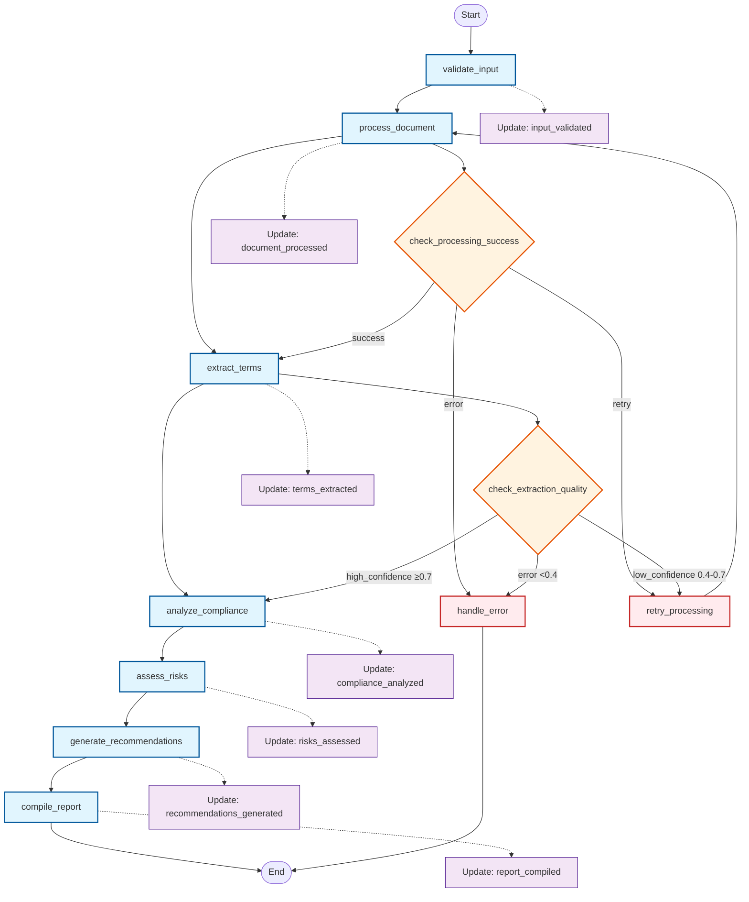
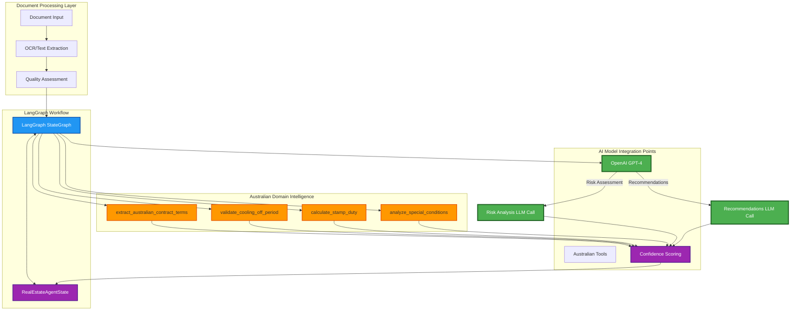
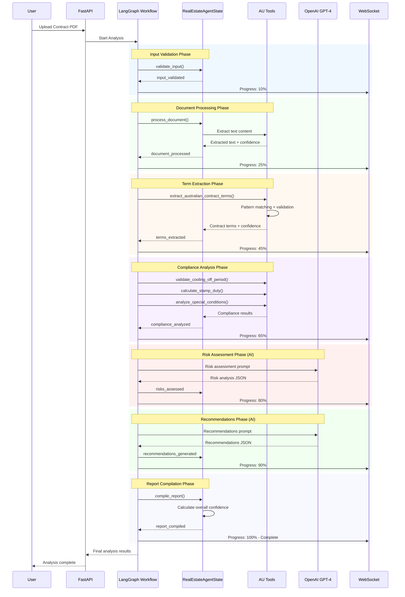
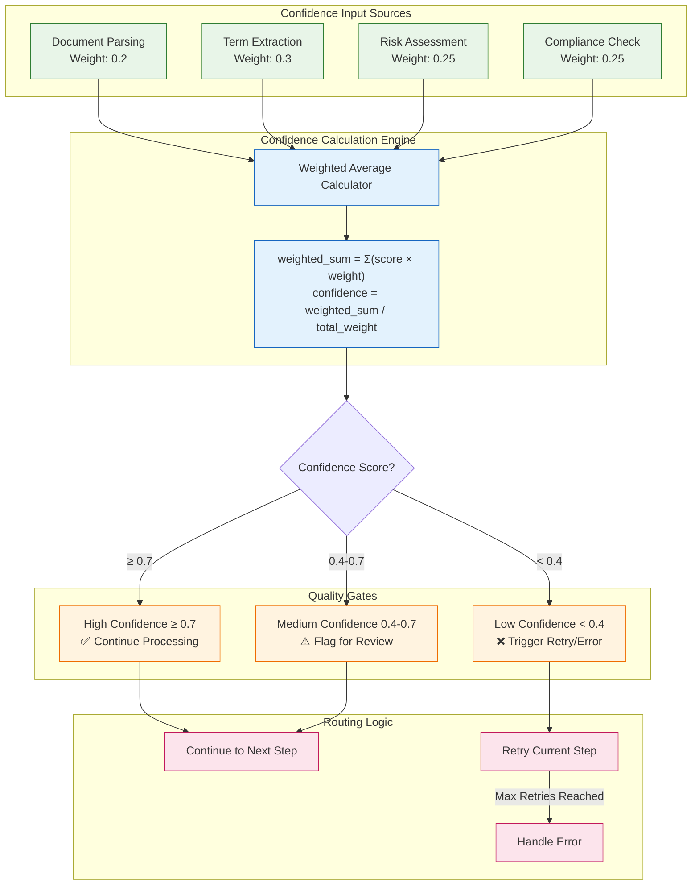
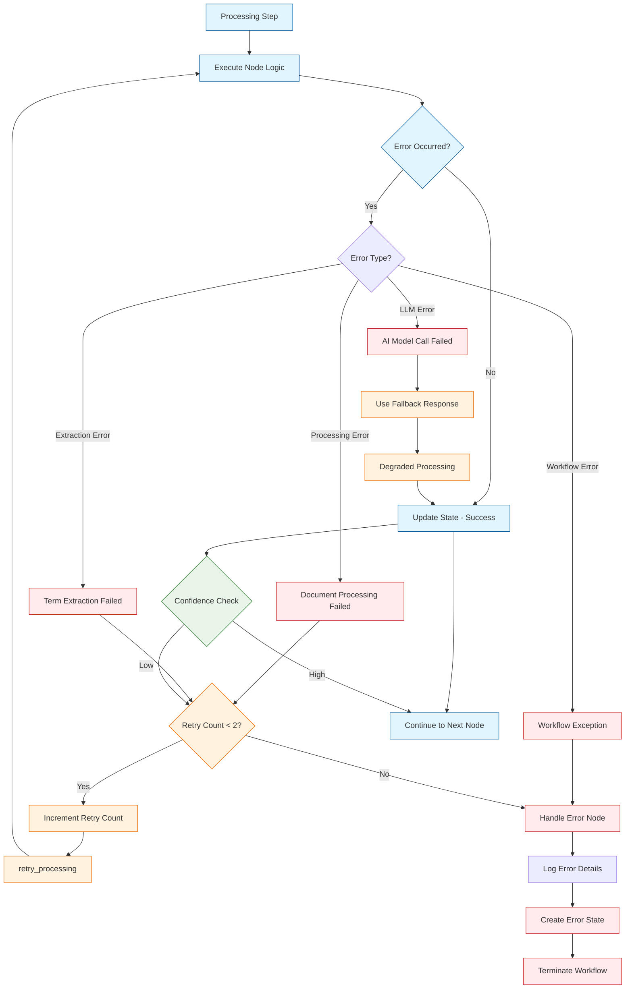
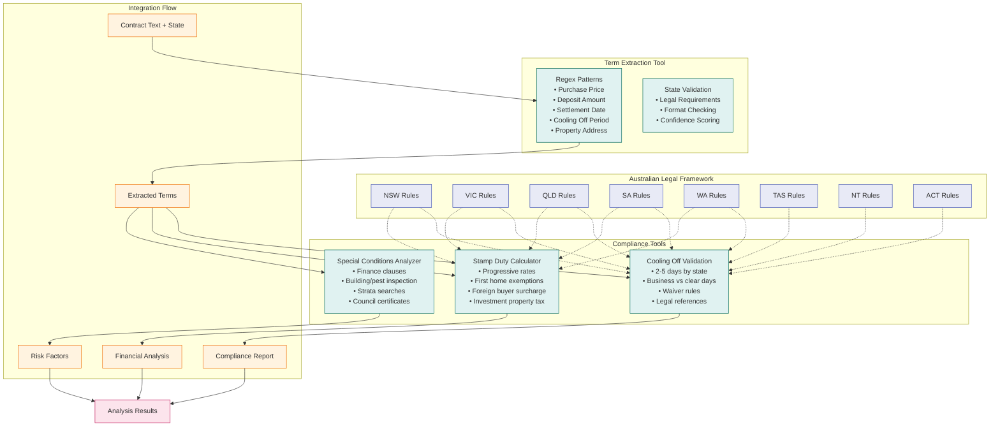

# LangGraph Workflow Architecture - Real2.ai Contract Analysis

## 1. Complete LangGraph Workflow Overview

## 2. AI Model Integration Architecture

## 3. State Management and Data Flow

## 4. Confidence Scoring System

## 5. Error Handling and Recovery Flow

## 6. Australian Tools Integration Details

## 7. Performance Optimization Opportunities

```mermaid
graph TD
    subgraph "Current Bottlenecks"
        SEQ[Sequential LLM Calls<br/>Risk + Recommendations<br/>3-5 seconds each]
        
        DOC_PROC[Document Processing<br/>OCR dependency<br/>2-5 seconds]
        
        STATE_SIZE[Large State Objects<br/>Full document content<br/>Memory overhead]
        
        NO_CACHE[No Result Caching<br/>Repeated processing<br/>Same documents]
    end
    
    subgraph "Optimization Strategies"
        PARALLEL[Parallel Processing<br/>• Concurrent LLM calls<br/>• Independent analysis branches<br/>• Async tool execution]
        
        STREAM[Streaming Results<br/>• Progressive updates<br/>• Partial result delivery<br/>• Real-time feedback]
        
        CACHE[Intelligent Caching<br/>• Document hash caching<br/>• Tool result caching<br/>• State compression]
        
        PREPROC[Document Preprocessing<br/>• Image enhancement<br/>• Format optimization<br/>• Quality assessment]
    end
    
    subgraph "Implementation Plan"
        PHASE1[Phase 1: Parallel Tools<br/>• Concurrent AU tools<br/>• Async state updates<br/>• 30% time reduction]
        
        PHASE2[Phase 2: LLM Optimization<br/>• Parallel risk/recommendations<br/>• Streaming responses<br/>• 40% time reduction]
        
        PHASE3[Phase 3: Caching Layer<br/>• Result caching<br/>• State optimization<br/>• 60% reduction repeated docs]
    end
    
    %% Current bottleneck flows
    SEQ --> IMPACT1[7-15 seconds total processing]
    DOC_PROC --> IMPACT1
    STATE_SIZE --> IMPACT2[High memory usage]
    NO_CACHE --> IMPACT3[Redundant processing]
    
    %% Optimization flows
    PARALLEL --> BENEFIT1[3-8 seconds processing]
    STREAM --> BENEFIT2[Better UX]
    CACHE --> BENEFIT3[Instant repeated results]
    PREPROC --> BENEFIT4[Higher OCR accuracy]
    
    %% Implementation progression
    PHASE1 --> PHASE2
    PHASE2 --> PHASE3
    
    %% Styling
    classDef bottleneck fill:#ffebee,stroke:#c62828
    classDef optimization fill:#e8f5e8,stroke:#2e7d32
    classDef implementation fill:#e3f2fd,stroke:#1565c0
    classDef impact fill:#fff3e0,stroke:#ef6c00
    
    class SEQ,DOC_PROC,STATE_SIZE,NO_CACHE bottleneck
    class PARALLEL,STREAM,CACHE,PREPROC optimization
    class PHASE1,PHASE2,PHASE3 implementation
    class IMPACT1,IMPACT2,IMPACT3,BENEFIT1,BENEFIT2,BENEFIT3,BENEFIT4 impact
```

## Key Architecture Insights

### **Strengths of Current Design**
- **Robust Error Handling**: Multi-level error recovery with graceful degradation
- **Domain Expertise**: Deep Australian property law integration
- **Quality Gates**: Confidence-based routing ensures reliability
- **Real-time Updates**: WebSocket integration for user experience

### **Optimization Opportunities**
- **Parallel Processing**: Independent analysis branches can run concurrently
- **Caching Strategy**: Document and tool result caching for performance
- **State Optimization**: Lightweight state management with references
- **Streaming Results**: Progressive result delivery for better UX

### **Scalability Considerations**
- **Workflow Orchestration**: LangGraph provides excellent scalability foundation
- **Resource Management**: Need connection pooling and rate limiting
- **Cost Optimization**: Intelligent LLM usage based on confidence scores
- **Monitoring**: Comprehensive logging and metrics for production operations

This architecture demonstrates sophisticated AI workflow orchestration with strong domain expertise and clear paths for optimization and scaling.