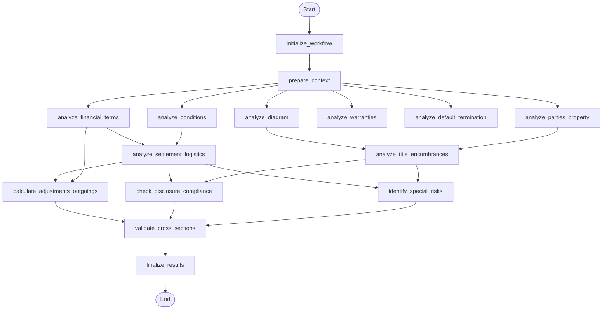

## Step 2 Section Analysis Workflow (LangGraph)

This diagram reflects the control flow defined in `backend/app/agents/subflows/step2_section_analysis_workflow.py`.

### Phases
- **Foundation Analysis (parallel)**: Parties/Property, Financial Terms, Conditions, Warranties, Default & Termination, Diagram semantics
- **Dependent Analysis (sequenced)**: Settlement Logistics depends on Financial Terms and Conditions; Title & Encumbrances depends on Diagram semantics and Parties/Property
- **Synthesis Analysis (sequenced)**: Adjustments & Outgoings depends on Settlement Logistics and Financial Terms; Disclosure Compliance and Special Risks depend on Settlement Logistics and Title & Encumbrances → Cross-section Validation → Finalization

### Node Key
- **initialize_workflow**: Validate inputs, set `start_time`, emit initial progress.
- **prepare_context**: Prepare retrieval/context, hoist inputs and derive legal requirements when needed.
- **analyze_parties_property**: Analyze parties and property description.
- **analyze_financial_terms**: Analyze consideration, deposits, timing.
- **analyze_conditions**: Analyze conditions precedent/subsequent.
- **analyze_warranties**: Analyze warranties and representations.
- **analyze_default_termination**: Analyze defaults and termination.
- **analyze_diagram**: Analyze diagram semantics uploaded or derived.
- **analyze_settlement_logistics**: Settlement timing, deliverables, logistics.
- **analyze_title_encumbrances**: Title, encumbrances, related diagrams/artifacts.
- **calculate_adjustments_outgoings**: Compute adjustments and outgoings.
- **check_disclosure_compliance**: Validate disclosure obligations.
- **identify_special_risks**: Surface special conditions and risk flags.
- **validate_cross_sections**: Cross-check for inconsistencies.
- **finalize_results**: Aggregate outputs and produce final artifacts.

