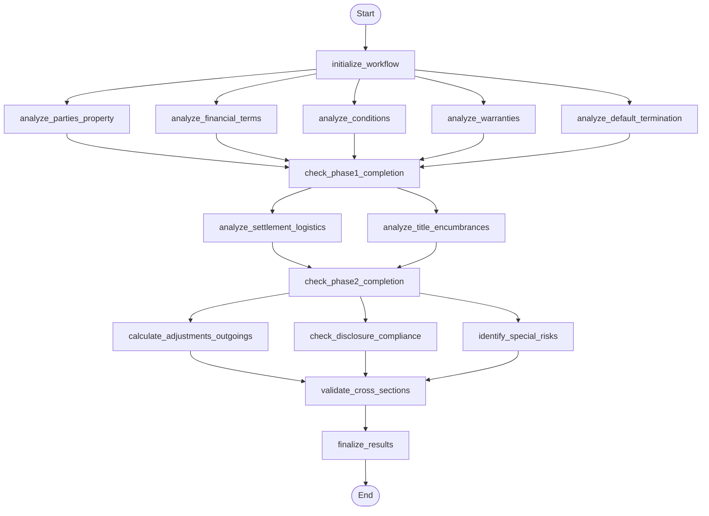

## Step 2 Section-by-Section Analysis Workflow (LangGraph)

This diagram reflects the control flow defined in `backend/app/agents/subflows/step2_section_analysis_workflow.py`.

### Node Key
- **initialize_workflow**: Prepare initial state and inputs
- **analyze_parties_property**: Analyze parties and property details
- **analyze_financial_terms**: Analyze payment, price, deposits and timing
- **analyze_conditions**: Analyze conditions precedent/subsequent and contingencies
- **analyze_warranties**: Analyze representations and warranties
- **analyze_default_termination**: Analyze default/termination clauses and remedies
- **check_phase1_completion**: Verify all foundation analyses completed
- **analyze_settlement_logistics**: Analyze settlement/possession, deliverables, timelines
- **analyze_title_encumbrances**: Analyze title, encumbrances, easements, registrations
- **check_phase2_completion**: Verify dependent analyses completed
- **calculate_adjustments_outgoings**: Compute adjustments, rates, outgoings
- **check_disclosure_compliance**: Validate disclosure obligations and compliance
- **identify_special_risks**: Identify special conditions and risk exposures
- **validate_cross_sections**: Cross-check findings across sections for consistency
- **finalize_results**: Aggregate outputs and produce final analysis artifacts

